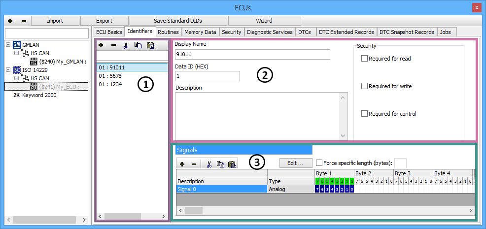
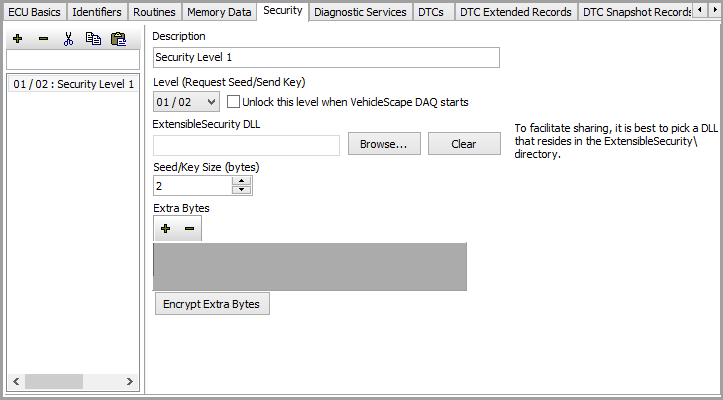

# ISO 14229 ECUs

If an ISO 14229 ECU is selected on the ECUs view then the tabs after the ECU Basics tab will look like those along the top of **Figure 1**. These other tabs let you create and change diagnostic items like DIDs, Routines, Memory Data, DTCs, and DTC Extended Records. There are also tabs for setting up ECU security access and diagnostic database jobs. Just click on a tab to see all items of that type in the ECU. A shared interface is used to enter data for most types of items. The Identifiers tab in Figure 1 is an example of this interface.

The area on the left (Figure 1: ) has a list for finding, selecting, and editing diagnostic items. The **+** and **-** buttons add and delete items in the list. The cut, copy, and paste buttons will cut, copy, and paste items in the list. Type in the search field above the list to quickly find items in a long list.\
\
The upper right area (Figure 1: ) defines basic aspects of the item selected in the list. The first field is the item's short name used for display throughout Vehicle Spy.The second field is the item's hexadecimal identifier and varies slightly depending upon the item type. For Identifiers and Routines it is a 2 byte Data ID. For Memory Data it is a Start Memory Address of 1 to 5 bytes or even more. DTCs use a 3 byte DTC Value and DTC Extended Records use a 1 byte Identifier. The third field can have a long description to help understand what the item is or describe its data.\
\
An ECU might require security access before allowing read, write, or control of a diagnostic item. Use the Security checkboxes to indicate which actions will require secured access. If enabled, Vehicle Spy will attempt to unlock the ECU before performing the action on the selected item.\
\
The lower right area (Figure 1: ) defines signals for the diagnostic item selected in the list. Signals are defined the same way as message signals are defined in the Messages Editor. Note that DTCs do not have signals, but their Extended Records do. The checkbox for **Force specific length** forces the data to a specified length when writing to an Identifier using job $2E.

### Security Tab (Figure 2)

The Security tab determines how Vehicle Spy will attempt to unlock a secured ISO 14229 ECU. In general, an ECU is unlocked by requesting a seed from it and sending it the correct key. An ECU can require different levels of security for diagnostic actions such as reading crash data, writing an odometer, or controlling headlamps for example. The different levels of security are linked to pairs of Request Seed/Send Key messages. The Extensible Security DLL file contains the algorithm that calculates the key from the requested seed. Extra bytes may also be required to unlock the ECU. As with all ECU setup tabs, the Security information will typically be imported from a database; but can be manually entered as well.

### Jobs Tab

The Jobs tab can create and launch Database Jobs. The interface is identical to the Diagnostics Setup view where User Jobs are created.

### Saving Changes

When finished making changes don't forget to click the **Save Database Changes** button located at the top of the ECUs view, above the tabs. This will store the changes into the diagnostics database file (\*.gmd).
