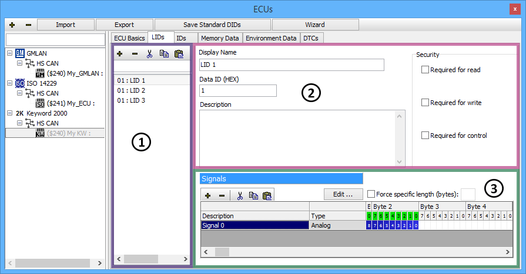

# Keyword 2000 ECUs

If a Keyword 2000 ECU is selected on the [ECUs](../../main-menu-setup/ecus-view/) view then the tabs after the ECU Basics tab will look like those along the top of **Figure 1**. These other tabs let you create and change diagnostic items like LIDs, IDs, and Memory Data. Just click on a tab to see all items of that type in the ECU. A shared interface is used to enter data for the different types of items. The LIDs tab in Figure 1 is an example of this interface.

The area on the left (Figure 1: ) has a list for finding, selecting, and editing diagnostic items. The "**+**" and "**-**" buttons add and delete items in the list. The cut, copy, and paste buttons will cut, copy, and paste items in the list. Type in the search field above the list to quickly find items in a long list.

The upper right area (Figure 1: ) defines basic aspects of the item selected in the list. The first field is the item's short name used for display throughout Vehicle Spy. The second field is the item's hexadecimal identifier and varies slightly depending upon the item type. For LIDs and IDs it is a 1 byte Identifier or Parameter ID. For Memory Data it is a 2 to 4 byte Start Memory Address. The third field can have a long description to help understand what the item is or describe its data.

The lower right area (Figure 1: ) defines signals for the diagnostic item selected in the list. Signals are defined the same way as [message signals](../message-editor/message-signals/) are defined in the Messages Editor.

### Environment Data Tab

Diagnostic Trouble Codes (DTCs) requested from a Keyword 2000 ECU can include extra environment data at the time the code was set, such as battery voltage or air temperature for example. The Environment Data tab lets you specify these extra signals that will apply to all DTCs requested from the selected ECU.

### Saving Changes

When finished making changes don't forget to click the **Save Database Changes** button located at the top of the ECUs view, above the tabs. This will store the changes into the [diagnostics database](../../main-menu-setup/network-databases.md) file (\*.gmd).
