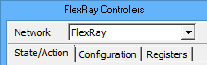

# FlexRay Controllers

Some vehicles today use FlexRay networks for time-critical features that require a low and known latency. Examples include control-by-wire, cruise control, traction control, and active suspension systems that are becoming more complex as driverless vehicles continue being developed.

Intrepid Control Systems makes FlexRay products to monitor, log, and interact with vehicle FlexRay networks. ICS FlexRay hardware includes a cluster of two "coldstart" nodes to allow connections to non-coldstart nodes and to allow simulation without the need of other devices. Vehicle FlexRay clusters operate on predefined schedules, so the ICS hardware must be configured to synchronize to the vehicle schedule to work properly.

### How Does FlexRay Work?

To keep these Vehicle Spy help files to a reasonable size, it is assumed the reader already has some knowledge of how FlexRay works. FlexRay is considerably different from other vehicle networks like LIN, CAN, and ethernet. ICS products follow the FlexRay Protocol 2.1A specification that includes a good example of a fault free startup. Excellent sources of FlexRay information can also be found across the internet.

Vehicle Spy has a FlexRay Cycles view as a visual aid for understanding basic FlexRay concepts such as cycles, frames in static and dynamic slots, and channels A and B.

### Overview

Vehicle Spy's FlexRay Controllers is used to configure, monitor, and troubleshoot the FlexRay nodes within ICS hardware. A tabbed interface has features to control cluster and node actions, see node state changes, configure cluster and node parameters, and see the contents of node registers. FlexRay Controllers view is opened from the Spy Networks menu.

The top of FlexRay Controllers view has a **Network** selection (Figure 1) that should be chosen first because it applies to most of the features located on the tabs below it.

Refer to Table 1 for a list of features on each of the FlexRay Controllers tabs along with links to pages explaining them further.

**Table 1: FlexRay Controllers Tabs**

| FlexRay Controllers Tab | Features                                                                                                                                                                                                         |
| ----------------------- | ---------------------------------------------------------------------------------------------------------------------------------------------------------------------------------------------------------------- |
| State/Action            | 
Select options for startup, wakeup, and frame/database synchronization.  Execute cluster and node actions.  View the state of each controller within ICS hardware.
                            |
| Configuration           | 
Configure cluster parameters that affect both nodes.  Configure parameters for each node, including their wakeup channel.  Select database synchronization options for the cluster and nodes.
 |
| Registers               | View memory snapshots of both node controllers.                                                                                                                                                                  |

### Getting FlexRay Running

The general flow of tasks to get a FlexRay connection running in Vehicle Spy is:

1. Configure the FlexRay cluster and node parameters within ICS hardware with these methods:
2.
   1. In Network Databases, load a FIBEX or ARMXL file.
   2. On the FlexRay Controllers Configuration tab, edit the cluster and node parameters.
3. On the State/Action and Configuration tabs, select startup and synchronization options.
4. Verify ICS FlexRay hardware is connected to PC USB and a FlexRay network.
5. Take Vehicle Spy online with the ICS hardware.\
   FlexRay traffic should appear on Messages view.
6. If no traffic is shown, begin troubleshooting by watching POC State changes, executing cluster and node actions, and reviewing register dump data.
