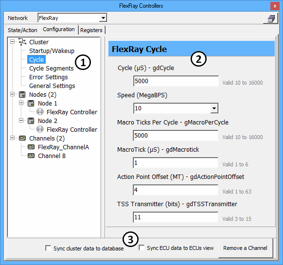

# FlexRay Controllers: Configuration Tab

The two FlexRay coldstart nodes within ICS hardware are configured using the [FlexRay Controllers](./) Configuration tab. The tab has parameters organized into Cluster, Nodes, and Channels branches in a +/- tree on the left (Figure 1:) and their data entry fields on the right (Figure 1:). Synchronization settings are included along the bottom of the tab.

Remember to select the correct **Network** above the tab before making any changes.

### Synchronization Settings

Synchronization settings located at the bottom (Figure 1:) can affect the entire tab, so they will be explained first. Note the [State/Action](flexray-controllers-state-action-tab.md) tab has an option to synchronize node transmit frames to ECU database frames.

**Table 1: Configuration Tab - Synchronization Settings**

| Setting                       | Description                                                                                                                                                                                                                                                                                                                                                                                                                                                                                                                |
| ----------------------------- | -------------------------------------------------------------------------------------------------------------------------------------------------------------------------------------------------------------------------------------------------------------------------------------------------------------------------------------------------------------------------------------------------------------------------------------------------------------------------------------------------------------------------- |
| Sync cluster data to database | 
On - All settings in the Cluster branch come from a FIBEX or ARMXL file loaded in <a href="../../main-menu-setup/network-databases.md">Network Databases</a>. This also disables manual data entry of all settings in the Cluster branch.  Off - All cluster settings must be entered manually.
                                                                                                                                                                                                               |
| Sync ECU data to ECUs view    | 
On - All settings in the Nodes branch come from a FIBEX or ARMXL file loaded in <a href="../../main-menu-setup/network-databases.md">Network Databases</a>. This also disables manual data entry of all settings in the Nodes branch. An ECU is chosen for a node on the State/Action tab <a href="flexray-controllers-state-action-tab.md#state-action-status-table">status table</a>, <strong>Node Name</strong> pulldown list after loading a database.  Off - All node settings must be entered manually.
 |
| Add/Remove a Channel          | Toggles channel B on and off.                                                                                                                                                                                                                                                                                                                                                                                                                                                                                              |

### Cluster Branch

Vehicle Spy has many configurable cluster settings to change the FlexRay wakeup symbol, cycle structure, and segment structures. Each setting has a mouseover tooltip to briefly describe what it does. Complete definitions are in the FlexRay 2.1A protocol specification and E-Ray User's Manual, so they will not be detailed here. The settings can be loaded from a database using **Sync cluster data to database** or can be typed in manually and saved in a VS3 file.

### Nodes Branch

Similar to the Cluster branch, there are many settings to change how each coldstart node in the ICS FlexRay hardware will operate. Each setting is already defined in the FlexRay 2.1A protocol specification and E-Ray User's Manual, so they will not be detailed here. The settings can be loaded from a database using **Sync ECU data to ECUs view** or can be typed in manually and saved in a VS3 file.

### Channels Branch

This branch shows if channel A or both channels A and B are being used. Click **Add/Remove a Channel** to enable or disable channel B.
