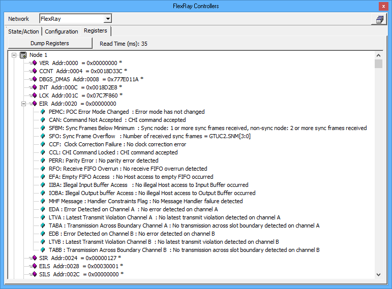

# FlexRay Controllers: Registers Tab

Use the [FlexRay Controllers](./) Registers tab to gather and view the memory register information from both FlexRay controllers onboard ICS hardware. Go [online](../../../basic-operation-of-vehicle-spy/running-and-stopping.md) with the device and click **Dump Registers** to see the results from both nodes in a +/- tree.

This level of detail is not usually needed for normal FlexRay operations, but can be useful when troubleshooting difficult issues. The hieroglyphics of acronyms in the memory dump are defined in the E-Ray User's Manual, so they will not be detailed here.

Note: The Registers tab is not affected by the **Network** selection above the tabs.

