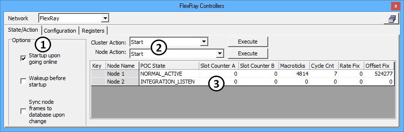

# FlexRay Controllers: State/Action Tab

The [FlexRay Controllers](./) State/Action tab is where the two FlexRay coldstart nodes within ICS hardware can be controlled and monitored. The tab is divided into Options, actions, and a node status table as shown in Figure 1.

Remember to select the correct **Network** above the tab before using any of the features.

Page navigation aids are included here to help with the long page length:

[**Options**](flexray-controllers-state-action-tab.md#options) **\*\*\*\*** [**Actions**](flexray-controllers-state-action-tab.md#cluster-action) **\*\*\*\*** [**Status Table**](flexray-controllers-state-action-tab.md#state-action-status-table) **\*\*\*\*** [**States**](flexray-controllers-state-action-tab.md#poc-states)

### Options

The Options area (Figure 1:) includes some startup and synchronization settings. Additional options for synchronizing to a database are located at the bottom of the [Configuration](flexray-controllers-configuration-tab.md) tab.

**Table 1: State/Action Options**

| State/Action Option                      | Description                                                                                                                                                                                                                                                                                                                                                                                                                                                                                                                                                                                        |
| ---------------------------------------- | -------------------------------------------------------------------------------------------------------------------------------------------------------------------------------------------------------------------------------------------------------------------------------------------------------------------------------------------------------------------------------------------------------------------------------------------------------------------------------------------------------------------------------------------------------------------------------------------------- |
| Startup upon going online                | 
On - ICS hardware will be the "leading coldstart node", so it will coldstart the FlexRay cluster after going online with VSpy.  Off - ICS hardware will be a "following coldstart node", so it will begin in a listen state after going online with VSpy. A startup from an external FlexRay node is needed before frames will appear.
                                                                                                                                                                                                                                                |
| Wakeup before startup                    | 
<strong>Startup upon going online</strong> must be ON before this feature will work.  On - Each node within ICS hardware will transmit a FlexRay wakeup pattern on its wakeup channel after going online with VSpy, but before it does a coldstart. The wakeup pattern and channel are defined on the <a href="flexray-controllers-configuration-tab.md">Configuration</a> tab. A wakeup pattern must have at least two wakeup symbols to be successful.  Off - ICS hardware will not send a FlexRay wakeup before doing a coldstart.
                                           |
| Sync node frames to database upon change | 
This setting can synchronize <a href="../message-editor/messages-editor-receive-transmit-and-database-tables.md">Messages Editor Transmit frames</a> to the Database frames.  On - After selecting an ECU in the Node Name list, all transmit frames assigned to that node are deleted and replaced with all database frames from the ECU. The ECUs and their database frames come from FIBEX or ARMXL files loaded in <a href="../../main-menu-setup/network-databases.md">Network Databases</a>.  Off - Node transmit frames are not forced to be synchronized to a database.
 |

### FlexRay Wakeup and Coldstart

FlexRay wakeup and coldstart can be confusing, so they are explained further here.

A FlexRay cluster is a collection of at least two coldstart nodes and usually some non-coldstart nodes too. Coldstart nodes can start or join FlexRay cycling, but non-coldstart nodes can only join cycling.

FlexRay cycling begins if at least two coldstart nodes are awake and then one of them does a coldstart A node wakeup can come from an external trigger OR from a FlexRay wakeup sent by a coldstart node. A FlexRay wakeup is a pattern of at least two wakeup symbols sent on only one channel at a time. The entire cluster of nodes will wake up after detecting a FlexRay wakeup pattern on their wakeup channel, assuming the nodes were not already awake from their external triggers.

### Cluster Action

ICS FlexRay hardware comes with two built-in nodes that can act as a simple cluster by itself or can be connected to a larger cluster of nodes. The cluster inside ICS hardware can be controlled on the State/Action tab by executing a **Cluster Action** (Figure 1:) while Vehicle Spy is online.

**Table 2: Cluster Actions**

| Cluster Action          | Description                                                                                                                                                                     |
| ----------------------- | ------------------------------------------------------------------------------------------------------------------------------------------------------------------------------- |
| Start                   | Forces the ICS hardware cluster to coldstart, which can also get an external cluster to begin cycling if the external cluster is already awake.                                 |
| Stop                    | Forces the ICS hardware cluster to stop cycling, but this will not stop an external cluster that is already cycling.                                                            |
| Restart                 | Stops the cluster first before doing a Start.                                                                                                                                   |
| Reconfigure and Restart | Reconfigures the ICS hardware cluster to the [Configuration](flexray-controllers-configuration-tab.md) tab cluster settings, then forces the ICS hardware cluster to coldstart. |

### Node Action

There are many choices for a Node Action as described in Table 3 and most of them refer to specific controller states. Actions at this lower level are not usually needed unless trying to troubleshoot specific issues.

To perform a Node Action, select a node by highlighting its row in the status table, select a **Node Action** (Figure 1:), then click Execute to perform the selected action on the highlighted node.

It is strongly recommended to refer to state transition diagrams in the FlexRay Protocol 2.1A specification when using these node actions.

**Table 3: Node Actions**

| Node Action                        | Description                                                                                                                                                                                                                                                                                                                                                                                                                 |
| ---------------------------------- | --------------------------------------------------------------------------------------------------------------------------------------------------------------------------------------------------------------------------------------------------------------------------------------------------------------------------------------------------------------------------------------------------------------------------- |
| Start                              | Forces node to coldstart.                                                                                                                                                                                                                                                                                                                                                                                                   |
| Stop                               | 
Forces node to stop cycling.  If POC state is NORMAL_ACTIVE then forces node to stop after the current cycle is done. (i.e. Halt)  If POC state is not NORMAL_ACTIVE then forces node to immediately stop even if the current cycle is not done yet. (i.e. Freeze)
                                                                                                                                       |
| Restart                            | Stops the node first before doing a Start.                                                                                                                                                                                                                                                                                                                                                                                  |
| Reconfigure and Restart            | Stops the node, then reconfigures it to [Configuration](flexray-controllers-configuration-tab.md) tab node settings, then forces node to coldstart.                                                                                                                                                                                                                                                                         |
| Set POC to Config                  | 
(POC means Protocol Operation Control, which is the FlexRay state control logic within the node.)  Forces node state to DEFAULT_CONFIG or CONFIG depending upon when this action is attempted.  Values are NOT configured until Node Action <strong>Perform Config of CHI and Msg Bufs</strong> is done.
                                                                                                 |
| Set POC to Ready                   | Forces node to be ready to send a wakeup, begin a coldstart, or jump into a cycling cluster.                                                                                                                                                                                                                                                                                                                                |
| Set POC to Wakeup                  | Forces node to send a wakeup pattern as defined on the Configuration tab.                                                                                                                                                                                                                                                                                                                                                   |
| Set POC to Monitor                 | Forces node to monitor for wakeups and cycling, but not send any frames itself.                                                                                                                                                                                                                                                                                                                                             |
| Set POC to Halt                    | Forces node to stop cycling after the current cycle is done.                                                                                                                                                                                                                                                                                                                                                                |
| Set POC to Startup                 | Forces node to coldstart an inactive cluster or jump into a cycling cluster.                                                                                                                                                                                                                                                                                                                                                |
| Set POC to Run                     | Forces a ready node to startup, otherwise does nothing.                                                                                                                                                                                                                                                                                                                                                                     |
| Set POC to Freeze                  | Forces node to immediately stop cycling even if the current cycle is not done yet.                                                                                                                                                                                                                                                                                                                                          |
| Set POC to Send MTS                | 
Forces node to send a Media Access Test Symbol. The MTS is sent within a Symbol Window which is a cycle segment defined on the Configuration tab.  Note: An MTS pulse is the same as a Collision Avoidance Symbol (CAS), but MTS is sent within a cycle and CAS is sent outside of a cycle.
                                                                                                                    |
| Set POC to All Slots               | Forces node from single slot mode to all slots mode. Single slot mode is an optional feature to limit frame transmission during startup.                                                                                                                                                                                                                                                                                    |
| Set POC to Reset Status Indicators | Resets node status flags that track coldstart and wakeup events. This action works only if the POC state is READY or STARTUP.                                                                                                                                                                                                                                                                                               |
| Set POC to Clear RAMs              | Clears all POC related RAM in the node to zero. This action works only if the POC state is DEFAULT\_CONFIG or CONFIG.                                                                                                                                                                                                                                                                                                       |
| Perform Config of CHI and Msg Bufs | 
Forces node to configure its Controller Host Interface and message buffers. This action works only if the POC state is DEFAULT_CONFIG or CONFIG.  If POC state is DEFAULT_CONFIG then settings come from "hardcoded" values stored within ICS hardware.  If POC state is CONFIG then settings come from <a href="flexray-controllers-configuration-tab.md">Configuration</a> tab, Nodes branch settings.
 |

### State/Action Status Table

Each row in the status table (Figure 1:) represents one node in the ICS FlexRay hardware. A Vehicle Spy **Cluster Action** affects both nodes, but a **Node Action** only affects the selected node in the table.

For each node, the status table shows the current logic state and timing location within the overall FlexRay cycle schedule. The status table also allows an ECU from a FlexRay database to be assigned to a node.

**Table 4: State/Action Table**

| State/Action Status Column | Description                                                                                                                                                                                                                                                                                                                                                                                                                                                                                                                                                                                                                                                                                                                                  |
| -------------------------- | -------------------------------------------------------------------------------------------------------------------------------------------------------------------------------------------------------------------------------------------------------------------------------------------------------------------------------------------------------------------------------------------------------------------------------------------------------------------------------------------------------------------------------------------------------------------------------------------------------------------------------------------------------------------------------------------------------------------------------------------- |
| Key                        | Unused at this time.                                                                                                                                                                                                                                                                                                                                                                                                                                                                                                                                                                                                                                                                                                                         |
| Node Name                  | 
Name of the node as defined on the <a href="flexray-controllers-configuration-tab.md">Configuration</a> tab, Node Settings, ECU Short Name.  Also, an ECU can be assigned to the node here if an ECU database from a FIBEX or ARMXL file is already loaded in <a href="../../main-menu-setup/network-databases.md">Network Databases</a>. This quickly allows ICS hardware to simulate a FlexRay ECU.  WARNING: If the option <strong>Sync node frames to database upon change</strong> is ON then making an ECU selection here will replace all <a href="../message-editor/messages-editor-receive-transmit-and-database-tables.md">transmit frames</a> assigned to the node with database frames from the selected ECU.
 |
| POC State                  | 
Current state of the FlexRay logic in the node.  The many Protocol Operation Control states are described further in a table following this one. The node state can change due to external cluster connections or be changed directly by executing a Cluster or Node Action.
                                                                                                                                                                                                                                                                                                                                                                                                                                                    |
| Slot Counter A             | Current slot of channel A. Counter resets to 1 at the beginning of each cycle then counts slots across the static and dynamic segments until the end of the dynamic segment is reached.                                                                                                                                                                                                                                                                                                                                                                                                                                                                                                                                                      |
| Slot Counter B             | Same counting logic as channel A, but this tracks channel B.                                                                                                                                                                                                                                                                                                                                                                                                                                                                                                                                                                                                                                                                                 |
| Macroticks                 | Current macrotick within the current cycle. Counter resets to 0 at the beginning of each cycle.                                                                                                                                                                                                                                                                                                                                                                                                                                                                                                                                                                                                                                              |
| Cycle Cnt                  | Current cycle number that loops from 0 to 63.                                                                                                                                                                                                                                                                                                                                                                                                                                                                                                                                                                                                                                                                                                |
| Rate Fix                   | Current Rate Correction Value calculated by the node to adjust its macrotick frequency. Allows the node to compensate for internal clock drift and stay synchronized to a cycling cluster.                                                                                                                                                                                                                                                                                                                                                                                                                                                                                                                                                   |
| Offset Fix                 | Current Offset Correction Value calculated by the node to adjust its macrotick phase. Allows the node to compensate for internal clock drift and stay synchronized to a cycling cluster.                                                                                                                                                                                                                                                                                                                                                                                                                                                                                                                                                     |

### POC States

There are many Protocol Operation Control states that define FlexRay logic in a node. It is strongly recommended to refer to state transition diagrams in the FlexRay Protocol 2.1A specification when trying to understand the flow of these states.

A lookup table is included here for convenience, but this does not replace requirements from specifications. Most of this information is copied directly from the FlexRay 2.1A specification then edited for brevity. The states are listed alphabetically.

**Table 5: POC States**

| POC State Name                   | Description                                                                                                                                                                                                                                |
| -------------------------------- | ------------------------------------------------------------------------------------------------------------------------------------------------------------------------------------------------------------------------------------------ |
| ABORT\_STARTUP                   | Exit cluster startup process for various reasons then get ready to try again by going to STARTUP\_PREPARE.                                                                                                                                 |
| COLDSTART\_COLLISION\_RESOLUTION | Detect and resolve collisions between multiple simultaneous coldstart attempts of several coldstart nodes.                                                                                                                                 |
| COLDSTART\_CONSISTENCY\_CHECK    | Leading coldstart node checks whether frames transmitted by other following coldstart nodes fit into its schedule.                                                                                                                         |
| COLDSTART\_GAP                   | Leading coldstart node stops transmitting its startup frame. All nodes integrating on leading coldstart node will stop their integration attempt.                                                                                          |
| COLDSTART\_JOIN                  | Only following coldstart nodes enter this state. Upon entry they begin transmitting startup frames and continue to do so in subsequent cycles.                                                                                             |
| COLDSTART\_LISTEN                | Coldstart node tries to detect ongoing frame transmissions and coldstart attempts. A coldstart node still allowed to initiate a coldstart enters this state before actually performing a coldstart.                                        |
| CONFIG                           | Frame communication is stopped, all node configuration memory is accessible, and physical layer pins are set to their inactive state. Settings from the [Configuration](flexray-controllers-configuration-tab.md) tab are applied.         |
| DEFAULT\_CONFIG                  | Frame communication is stopped, all node configuration memory is accessible, and physical layer pins are set to their inactive state. Default settings "hardcoded" in the firmware are applied.                                            |
| HALT                             | Halts the node in preparation for reinitialization.                                                                                                                                                                                        |
| INITIALIZE\_SCHEDULE             | This state is entered as soon as a valid startup frame has been received in one of the listen states.                                                                                                                                      |
| INTEGRATION\_COLDSTART\_CHECK    | Only integrating coldstart nodes pass through this state. Verify clock can be corrected and leading coldstart node is still available.                                                                                                     |
| INTEGRATION\_CONSISTENCY\_CHECK  | Only integrating non-coldstart nodes pass through this state. Verify clock can be corrected and enough coldstart nodes are sending startup frames that agree with the node's own schedule.                                                 |
| INTEGRATION\_LISTEN              | Node waits for a valid startup frame or for a coldstart to be allowed.                                                                                                                                                                     |
| MONITOR\_MODE                    | Node receives wakeups and frames, but does not send any frames itself.                                                                                                                                                                     |
| NORMAL\_ACTIVE                   | Normal operation state following a successful startup. Node is synchronized to the cluster allowing continued frame transmission without disrupting other nodes. If synchronization problems occur, POC can transition to NORMAL\_PASSIVE. |
| NORMAL\_PASSIVE                  | Node can receive frames, but not transmit frames due to synchronization problems to the cluster. If synchronization improves, POC can transition back to NORMAL\_ACTIVE. If synchronization problems persist, POC transitions to HALT.     |
| READY                            | Node is ready to send a wakeup, coldstart a cluster, integrate into an ongoing cluster, or be configured again.                                                                                                                            |
| STARTUP\_PREPARE                 | Node prepares to listen for cluster activity.                                                                                                                                                                                              |
| STARTUP\_SUCCESS                 | This seems to not really be a POC state, but is actually a critical flag that must be true to enter the NORMAL\_ACTIVE state.                                                                                                              |
| WAKEUP\_DETECT                   | Node attempts to identify reason for wakeup collision detected in WAKEUP\_SEND state then returns to WAKEUP\_STANDBY.                                                                                                                      |
| WAKEUP\_LISTEN                   | Node prepares to quickly send a wakeup in a noise free scenario or waits a bit longer in a noisy environment.                                                                                                                              |
| WAKEUP\_SEND                     | Node sends wakeup pattern on wakeup channel defined on the Configuration tab. Node transitions to WAKEUP\_DETECT if collisions are detected.                                                                                               |
| WAKEUP\_STANDB                   | Node is waiting to send a wakeup pattern.                                                                                                                                                                                                  |

Page navigation aids are included here to help with the long page length:

[**Options**](flexray-controllers-state-action-tab.md#options) \*\*\*\* [**Actions**](flexray-controllers-state-action-tab.md#cluster-action) \*\*\*\* [**Status Table**](flexray-controllers-state-action-tab.md#state-action-status-table) \*\*\*\* [**States**](flexray-controllers-state-action-tab.md#poc-states) \*\*\*\* [**Top of Page**](flexray-controllers-state-action-tab.md)\*\*\*\*
