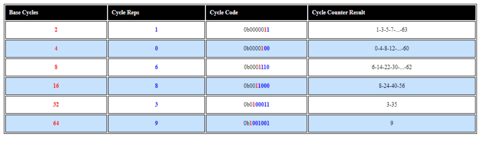

# FlexRay Cycles

Vehicle Spy's FlexRay Cycles view is a nice visual aid for understanding FlexRay concepts such as cycles, static frames, dynamic frames, and channels A and B. FlexRay Cycles view is opened from the [Spy Networks](./) menu.

After selecting the desired **Network** at the top, FlexRay Cycles view will show cluster activity for all connected nodes after going online with ICS hardware previously configured using [FlexRay Controllers](flexray-controllers/) view.

### Example of FlexRay Cycles View with an Active Cluster

Figure 1 shows an example of the FlexRay Cycles view for an active cluster. Each major row in the table represents one FlexRay cycle that has two minor rows representing channels A and B. The major row in the top window pane (Figure 1:) displays the last cycle completed. The number on the top right is the total number of frames detected. Loading a VS3 setup file resets the frame counter to zero.

The major rows in the lower window pane(Figure 1:) display the history of previous cycles completed. The negative numbers on the right indicate the previous cycle (-1), the next previous cycle (-2), etc.

Different colors show the various segments within each cycle as described in Table 1.

**Table 1: FlexRay Cycles Color Codes**

### What Else Does the Example Show?

The example in Figure 1 shows 25 static slots and 15 dynamic slots. Both channels A and B have traffic, but not the same traffic.

| For the current cycle (top window pane):                                                                                                                                                                                                | For the previous cycle (-1):                                                                                                                                                                                                |
| --------------------------------------------------------------------------------------------------------------------------------------------------------------------------------------------------------------------------------------- | --------------------------------------------------------------------------------------------------------------------------------------------------------------------------------------------------------------------------- |
| 
Channel A Static frames 1, 2, and 3 with 20 byte payloads. No dynamic frames.  Channel B Static frames 1 and 2 with 20 byte payloads. Dynamic frame 28 with 50 byte payload and frame 32 with 10 byte payload.
 | 
Channel A Static frames 1, 2, and 3 with 20 byte payloads. Dynamic frame 26 with 254 byte payload.  Channel B Static frames 1 and 2 with 20 byte payloads. Dynamic frame 30 with 100 byte payload.
 |

### FlexRay Highlights

The following information is provided for quick reference regarding items on FlexRay Cycles view:

### Cluster

* Every FlexRay network is a cluster of nodes.

### Nodes

* Each node can be a coldstart or non-coldstart node.
* At least two coldstart nodes are required for a cluster.
* Each node can have one or two channels.
* ICS FlexRay hardware has 2 coldstart nodes with 2 channels configured using \*\*\*\* [FlexRay Controllers](flexray-controllers/) view.

### Channels

* There are two channels, A and B.
* Channel B is optional.
* Both channels simultaneously loop through 64 cycles.
* Channels are time synchronized to each other, but not data synchronized.

### Cycles

* There are 64 cycles in a continuous loop from 0 to 63.
* Each cycle has segments in this order: static + dynamic\* + symbol window\* + network idle time. (\*optional)
* Each cycle has a maximum of 2047 slots.

* Dynamic frames can exist in every cycle or only in a subset of cycles called a "cycle set".
* Cycle sets are defined with a 7 bit cycle code.
* Vehicle Spy's [Messages Editor](message-editor/messages-editor-message-fields/) defines cycle sets using **Base Cycles** and **Cycle Reps** with examples shown in Table 2.

**Table 2: Examples of Cycle Sets for Dynamic Frames**

### Slots

* A slot is a window of time when a node can transmit a frame.
* Maximum number of static slots is 1023.

### Frames

* There are two types of frames, static and dynamic.
* Frame IDs can range from 1 to 2047, with 0 being invalid.
* Each frame is fully identified with a unique slot and channel, and an optional cycle code.
* Each frame has a payload of an even number of data bytes up to a maximum of 254.\\
* Static frames must all have the same payload length.
* A static frame can be sent on channel A, on channel B, or on both channels at the same time.\\
* Dynamic frames can have different payload lengths.
* A dynamic frame can be sent on channel A or on channel B, but not on both at the same time.
