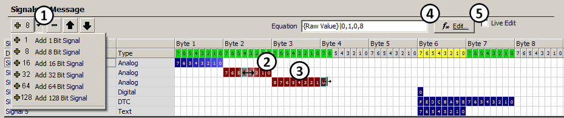
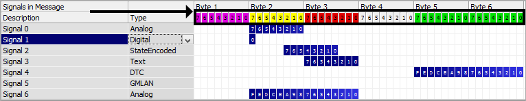

# Message Signals

Vehicle network messages contain raw data with signal information. Vehicle Spy allows decoding of this signal information from received messages and encodes this information into transmit messages. Signal definitions must always be associated with a message.

**Figure 1** shows the **Signals In Message** area, located near the bottom of the Messages Editor. Signals in the selected message can be seen and changed here. Click the **+ or - buttons** (Figure 1: ) to add or remove signals in a message. The **+** button defaults to adding a signal that is 8 bits long. Using the pull down next to the **+** button 1 bit signals, 8 bit signals, 16 bit signals, 32 bit signals, 64 bit signals, and 128 bit signals can be chosen to add.

Every signal in the message has a row showing its Description and Type. To edit the signal name, double click on it and type a new one. To change the signal type, click its Type cell and use the pulldown list.

Blue colored cells in each row represent the signal's bit length and bit position within the message. Signal position can be adjusted (Figure 1: ) by dragging the signal back and forth along the row. Signal length can be changed in a similar way by dragging on either edge of the signal (Figure 1: ). The blue bits turn brown while the signal position or length are being dragged.

The click & drag feature for the blue signal bits is limited to 64 bytes. Signal position or length that goes beyond 64 bytes must be specified using the Edit Signal dialog. To open the Edit Signal dialog, click the **fx Edit** button (Figure 1: ) or double click on the blue signal bits. Use Live Edit (Figure 1: ) to see raw data and decoded signals within the signal editor itself while Vehicle Spy is online.

As signals are moved around and change their lengths the colors will change near the top where the bit numbers are shown (Figure 2). The colors can quickly help show conflicts that may require further attention.

Refer to **Table 1** to see what each color indicates.

**Table 1: Signal Editor Color Coding**

| Color  | Condition          | Details                                          |
| ------ | ------------------ | ------------------------------------------------ |
| Gray   | Unused bit.        | Bits are undefined.                              |
| Green  | No conflicts.      | Bits defined by 1 signal equation.               |
| Yellow | Possible conflict. | Bits defined by 2 or more signal equations.      |
| Purple | Defined in table.  | Bits defined by Message Data Bytes.              |
| Red    | Conflict.          | Bits defined by equation and Message Data Bytes. |

Some signal types have unique characteristics that become clear while using the signal editor grid. Digital signals are 1 bit long. Text signals are a multiple of 8 bits long and byte aligned. DTC signals are 16 bits long and byte aligned.

Other signal parameters like analog value type, state table values, endianness, format, min, max, units, scaling, and J1939 settings can also be edited. Double click on the blue signal bits or press the **fx Edit** button (Figure 1: ) to open the Edit Signal dialog customized to the selected signal type.
