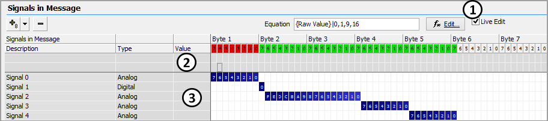

# Live Edit

The [Messages Editor](../) has a feature called **Live Edit** that allows raw data and decoded signals to be seen within the signal editor itself while Vehicle Spy is online. Live Edit is enabled with the checkbox (Figure 1:) located in the [Signals in Message](./) area.

Raw data will be updated and displayed in hexadecimal and binary formats along two rows across the top of the signal editor (Figure 1:). Decoded signal information will be displayed in the Value column (Figure 1:).

