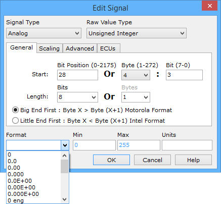
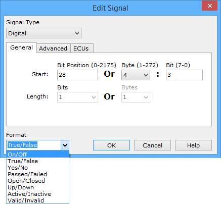

# Message Signal Format and Units

When decoding an analog or digital signal, the display format can be specified. For example, analog Engine RPM signal could be displayed as 1000.23423 or 1000.2. Many formats are available in the pulldown lists as shown in Figures 1 and 2.

Below are some examples to help explain each of the analog format categories:

* 0 = rounded integer
* 0.0 = rounded to 1 decimal place
* 0.00E+00 = scientific notation rounded to 2 decimal places
* 0.000 eng = 1 letter engineering (i.e. m, k, etc.) rounded to 3 decimal places
* 0.0 engf = multi-letter formal engineering (i.e. milli, kilo, etc.) rounded to 1 decimal place
* XXXX hex = 4 characters of hexadecimal
* XX bin = 16 bits of binary

Units can be more useful when combined with the "eng" or "engf" formats. For example, "0 eng" format with units V would format as follows:\

* 0.010 V as 10 mV
* 1200 V as 1 kV
* 0.000233 V as 233 uV

For digital signals, if the format list does not have what is needed (like Right/Left), type in any desired format that corresponds with binary 1/0.

