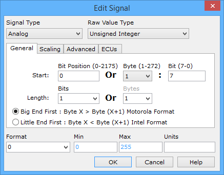

# Message Signal Type Analog

Setting the [Signal Type](message-signal-type.md) pull-down to Analog in the Edit Signal dialog sets the signal to an analog type (Figure 1).

### Raw Value Type

The **Raw Value Type** sets what type of analog signal is being decoded. The available Raw Value Types are described in Table 1.

**Table 1 - Raw Value Data Types**

| Raw Value Type                | Description                                                                                                                | 
Example (Motorola format)
                                                   |
| ----------------------------- | -------------------------------------------------------------------------------------------------------------------------- | ------------------------------------------------------------------------------------- |
| Unsigned Integer              | Can only represent a positive whole number or zero.                                                                        | $6225 = 25125                                                                         |
| Signed 2's Complement Integer | An integer format which can represent negative numbers by using the 2's complement of the magnitude. Most popular format.  | $E7 = -25                                                                             |
| Signed Sign/Magnitude         | An integer format which can represent negative numbers using the most significant bit for a sign bit.                      | $81 = -1                                                                              |
| 32 Bit IEEE Float             | IEEE standard representation for a 32 bit float variable.                                                                  | $59 C6 F3 B4 = 7e15                                                                   |
| 64 Bit IEEE Float             | IEEE standard representation for a 64 bit float variable.                                                                  | $43 38 DE 76 81 6D 80 00 = 7e15                                                       |
| Packed BCD                    | A data format where each nibble stores one decimal digit.                                                                  | $34 = decimal 34                                                                      |
| Tasking Float                 | Another way to represent a floating point number. This is 32 or 64 bits long, byte aligned, and unaffected by Endian-ness. | 
32 bit $C6 59 B4 F3 = 7e15  64 bit $38 43 76 DE 6D 81 00 80 = 7e15
 |

### General Tab

The signal's start position, length, and byte order are specified on the General tab. The Start [Bit Position or Byte: Bit](understanding-bit-and-byte-bit-positions.md) identifies where in the message the signal begins. The Length can be entered in bits or bytes. For some types, like a 32 bit IEEE float, the length is fixed and already entered in. The signal start position and length can also be changed by just dragging the blue bits around in the [Signals in Message](./) area.

Byte order (or endian-ness) deals with how multi-byte data is organized within the message. For example, in a two byte integer like 12345, will the first byte be the most significant byte (msb) or the least significant byte (lsb)? The Motorola format has the msb followed by the lsb (i.e. 12345 = $30 39). The Intel format has the lsb followed by the msb (i.e. 12345 = $39 30).

### Scaling Tab

After defining the Raw Value, apply scaling that converts it into an Engineering Value. There are three options for scaling with the first option being no scaling at all.

The second option is Linear mX+B scaling. This scaling applies a scaling factor (m) to the Raw Value (X) and then adds an offset (b). For example, a common way to represent temperature is 1 \* Raw Value - 40.

The third option is Custom scaling which gives complete control of the scaling and reverse scaling equations. Clicking the fx button for either equation opens the Edit Custom Scaling dialog. This dialog already includes clear instructions on its use, so it will not be repeated here.

### Advanced Tab

The Advanced tab includes settings related to J1939 Suspect Parameter Number (SPN) signals.

* Enable J1939 Invalid and Not Available states: signal is Invalid if all 1's + last bit = 0 and Not Available if all 1's.
* Use Sequential (0-N) bit counting for Intel signals (J1939 style): signal format used by J1939 SPNs.

### Format, Min, Max, & Units

The signal's display can be changed using [Format](message-signal-format-and-units.md), Min, Max, and [Units](message-signal-format-and-units.md) located at the bottom of the Edit Signal dialog.
