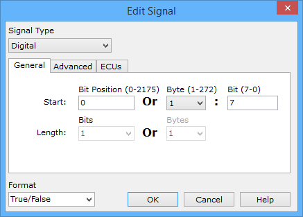

# Message Signal Type Digital

Setup a digital signal (1/0, on/off, true/false, etc) by setting the Signal Type pulldown to **Digital** in the Edit Signal dialog (Figure 1).

The Start Bit Position or Byte:Bit identifies where the signal is in the message. The signal position can also be changed by just dragging the blue bit around in the Signals in Message area. Digital signals are always 1 bit long, so the Length is always fixed at this value.

The signal's Format is selected from a pulldown list at the bottom of the dialog. If the list does not have the format desired (such as Right/Left), type in desired format that corresponds with binary 1/0.
