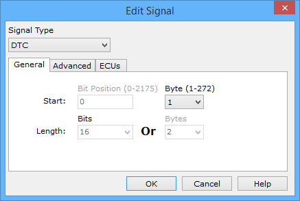
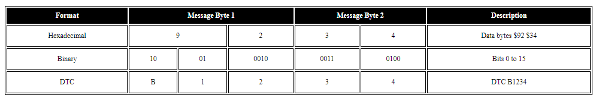

# Message Signal Type DTC

The DTC (Diagnostic Trouble Code) format is an automotive industry standard. The format relies on two bytes to form an alpha numeric code.\*

By setting up the Signal Type pulldown to **DTC** in the Edit Signal dialog (Figure 1), a DTC signal will be setup. Just select the Start byte where the DTC is located in the message and that's it!

Some limits are placed on the dialog to help avoid mistakes. DTC signals are byte aligned, so the Bit Position field is disabled. DTC signals are 2 bytes long, so the Length is already set to this value for you. To define the DTC further with a text description you can use a DTC Database.

### \*Details of How a DTC is Defined by 2 Bytes (16 bits)

Byte #: | Byte 1 | Byte 2 |\
Bit #: 0 1 | 2 3 | 4 5 6 7 | 8 9 10 11 | 12 13 14 15

Bits 0 & 1 - defines the only letter in the DTC.\
00 = P = Powertrain\
01 = C = Chassis\
10 = B = Body\
11 = U = serial data

Bits 2 & 3 - defines first digit of DTC.\
00 = 0\
01 = 1\
10 = 2\
11 = 3

Bits 4-7, 8-11, 12-15 - defines last 3 digits of DTC.\
Uses Binary Coded Decimal (each group of 4 bits (nibble) = 0-9).

Table 1 illustrates an example of the translation between data bytes $92 $34 and DTC B1234.

**Table 1: Example of DTC Translation**

