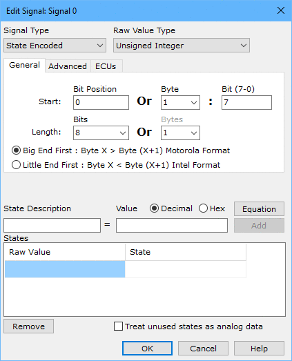

# Message Signal Type State Encoded

Setup a state encoded signal by setting the [Signal Type](https://cdn.intrepidcs.net/support/VehicleSpy/spyInValType.htm) pulldown to **State Encoded** in the Edit Signal dialog (Figure 1).

Specifying the Raw Value is the same as the analog signal setup. Please see the [analog signal](https://cdn.intrepidcs.net/support/VehicleSpy/spyInDecodeAnalog.htm) help topic for an explanation of how to do this.

Use the state table area to enter a State Description and the decimal Raw Value it represents. Click the **Add** button to add the state definition to the States list. Additional state definitions can be entered quickly by just typing new State Descriptions and tapping the keyboard Enter key. Vehicle Spy will automatically increment the Raw Value field by 1 to help speed things up. Edit the Raw Value field at any time if some values need to be skipped.

To delete a state definition from the list, click the state name then click the **Remove** button.

Any raw values without state definitions are considered to be unused states. Vehicle Spy normally shows unused states with the text **Invalid State**. To show unused states as numerical values, click the **Treat unused states as analog data** checkbox. This will activate the Scaling tab and the Format, Min, Max, and Units fields just like the setup for analog signals. These settings will be applied to any unused values and displayed accordingly.
