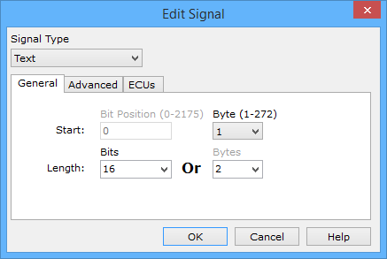

# Message Signal Type Text

Setup an ASCII text signal by setting the [Signal Type](message-signal-type.md) pulldown to **Text** in the Edit Signal dialog (Figure 1). Use the dialog to select the Start Byte and Length of the signal in the message.

Some limits are placed on this dialog to help prevent mistakes. The Text signal position is byte aligned, so the Bit Position field is disabled. The Text signal length is a multiple of 8 bits, so the Bits Length pulldown list is limited to those choices.

### ASCII Conversion Table

Table 1 is a lookup table to convert between ASCII character, decimal, and hexadecimal values. One byte represents one ASCII character. Vehicle Spy will automatically convert text signals, but this table may be helpful in certain situations.

**Table 1: ASCII Conversion Table**

| Character Name        | Char | Dec | Hex | Character Name | Char | Dec |     |
| --------------------- | ---- | --- | --- | -------------- | ---- | --- | --- |
| Null                  | NUL  | 0   | $00 | At Sign        | @    | 64  | $40 |
| Start of Heading      | SOH  | 1   | $01 | Capital A      | A    | 65  | $41 |
| Start of Text         | STX  | 2   | $02 | Capital B      | B    | 66  | $42 |
| End of Text           | ETX  | 3   | $03 | Capital C      | C    | 67  | $43 |
| End of Transmit       | EOT  | 4   | $04 | Capital D      | D    | 68  | $44 |
| Enquiry               | ENQ  | 5   | $05 | Capital E      | E    | 69  | $45 |
| Acknowledge           | ACK  | 6   | $06 | Capital F      | F    | 70  | $46 |
| Bell                  | BEL  | 7   | $07 | Capital G      | G    | 71  | $47 |
| Back Space            | BS   | 8   | $08 | Capital H      | H    | 72  | $48 |
| Horizontal Tab        | TAB  | 9   | $09 | Capital I      | I    | 73  | $49 |
| Line Feed             | LF   | 10  | $0A | Capital J      | J    | 74  | $4A |
| Vertical Tab          | VT   | 11  | $0B | Capital K      | K    | 75  | $4B |
| Form Feed             | FF   | 12  | $0C | Capital L      | L    | 76  | $4C |
| Carriage Return       | CR   | 13  | $0D | Capital M      | M    | 77  | $4D |
| Shift Out             | SO   | 14  | $0E | Capital N      | N    | 78  | $4E |
| Shift In              | SI   | 15  | $0F | Capital O      | O    | 79  | $4F |
| Data Link Escape      | DLE  | 16  | $10 | Capital P      | P    | 80  | $50 |
| Device Control 1      | DC1  | 17  | $11 | Capital Q      | Q    | 81  | $51 |
| Device Control 2      | DC2  | 18  | $12 | Capital R      | R    | 82  | $52 |
| Device Control 3      | DC3  | 19  | $13 | Capital S      | S    | 83  | $53 |
| Device Control 4      | DC4  | 20  | $14 | Capital T      | T    | 84  | $54 |
| Negative Acknowledge  | NAK  | 21  | $15 | Capital U      | U    | 85  | $55 |
| Synchronous Idle      | SYN  | 22  | $16 | Capital V      | V    | 86  | $56 |
| End of Transmit Block | ETB  | 23  | $17 | Capital W      | W    | 87  | $57 |
| Cancel                | CAN  | 24  | $18 | Capital X      | X    | 88  | $58 |
| End of Medium         | EM   | 25  | $19 | Capital Y      | Y    | 89  | $59 |
| Substitute            | SUB  | 26  | $1A | Capital Z      | Z    | 90  | $5A |
| Escape                | ESC  | 27  | $1B | Left Bracket   | \[   | 91  | $5B |
| File Separator        | FS   | 28  | $1C | Backward Slash | \\   | 92  | $5C |
| Group Separator       | GS   | 29  | $1D | Right Bracket  | ]    | 93  | $5D |
| Record Separator      | RS   | 30  | $1E | Caret          | ^    | 94  | $5E |
| Unit Separator        | US   | 31  | $1F | Underscore     | \_   | 95  | $5F |
| Space (blank)         |      | 32  | $20 | Back Quote     | \`   | 96  | $60 |
| Exclamation Point     | !    | 33  | $21 | Lower-case A   | a    | 97  | $61 |
| Double Quote          | "    | 34  | $22 | Lower-case B   | b    | 98  | $62 |
| Pound/Number Sign     | #    | 35  | $23 | Lower-case C   | c    | 99  | $63 |
| Dollar Sign           | $    | 36  | $24 | Lower-case D   | d    | 100 | $64 |
| Percent Sign          | %    | 37  | $25 | Lower-case E   | e    | 101 | $65 |
| Ampersand             | &    | 38  | $26 | Lower-case F   | f    | 102 | $66 |
| Single Quote          | �    | 39  | $27 | Lower-case G   | g    | 103 | $67 |
| Left Parenthesis      | (    | 40  | $28 | Lower-case H   | h    | 104 | $68 |
| Right Parenthesis     | )    | 41  | $29 | Lower-case I   | I    | 105 | $69 |
| Asterisk              | \*   | 42  | $2A | Lower-case J   | j    | 106 | $6A |
| Plus Sign             | +    | 43  | $2B | Lower-case K   | k    | 107 | $6B |
| Comma                 | ,    | 44  | $2C | Lower-case L   | l    | 108 | $6C |
| Hyphen / Minus Sign   | -    | 45  | $2D | Lower-case M   | m    | 109 | $6D |
| Period                | .    | 46  | $2E | Lower-case N   | n    | 110 | $6E |
| Forward Slash         | /    | 47  | $2F | Lower-case O   | o    | 111 | $6F |
| Zero Digit            | 0    | 48  | $30 | Lower-case P   | p    | 112 | $70 |
| One Digit             | 1    | 49  | $31 | Lower-case Q   | q    | 113 | $71 |
| Two Digit             | 2    | 50  | $32 | Lower-case R   | r    | 114 | $72 |
| Three Digit           | 3    | 51  | $33 | Lower-case S   | s    | 115 | $73 |
| Four Digit            | 4    | 52  | $34 | Lower-case T   | t    | 116 | $74 |
| Five Digit            | 5    | 53  | $35 | Lower-case U   | u    | 117 | $75 |
| Six Digit             | 6    | 54  | $36 | Lower-case V   | v    | 118 | $76 |
| Seven Digit           | 7    | 55  | $37 | Lower-case W   | w    | 119 | $77 |
| Eight Digit           | 8    | 56  | $38 | Lower-case X   | x    | 120 | $78 |
| Nine Digit            | 9    | 57  | $39 | Lower-case Y   | y    | 121 | $79 |
| Colon                 | :    | 58  | $3A | Lower-case Z   | z    | 122 | $7A |
| Semicolon             | ;    | 59  | $3B | Left Brace     | {    | 123 | $7B |
| Less-Than Sign        | <    | 60  | $3C | Vertical Bar   | \|   | 124 | $7C |
| Equals Sign           | =    | 61  | $3D | Right Brace    | }    | 125 | $7D |
| Greater-Than Sign     | >    | 62  | $3E | Tilde          | \~   | 126 | $7E |
| Question Mark         | ?    | 63  | $3F | Delete         | DEL  | 12  | $7F |

***
