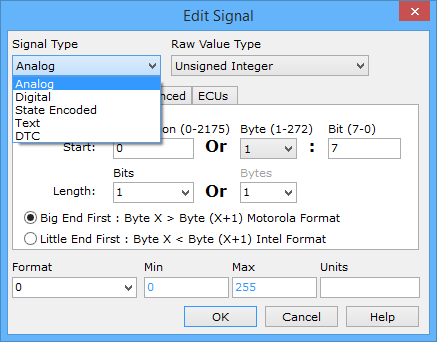

# Message Signal Type

The Signals in Message area at the bottom of the Messages Editor provides different ways to change the Signal Type:

* Click in the **Signal Type** column and make a pulldown list selection.
* Double click on blue signal bits to open the Edit Signal dialog (Figure 1).
* Click the  button to open the Edit Signal dialog (Figure 1).

The Edit Signal dialog customizes itself based upon the Signal Type selection. **Table 1** briefly describes each Signal Type and gives a few examples. Click on a Signal Type name to see further details for that type.

**Table 1: Signal Types**

| Signal Type   | Description                                                                                                                                          | Examples                                                                      |
| ------------- | ---------------------------------------------------------------------------------------------------------------------------------------------------- | ----------------------------------------------------------------------------- |
| Analog        | Continuous numbers.                                                                                                                                  | Engine RPM, Coolant Temperature, Throttle Position, Vehicle Speed             |
| Digital       | Binary, boolean, on/off type information.                                                                                                            | Park Brake Active, Cruise Control Active, Door Ajar                           |
| State Encoded | List of text descriptions which equate to specific values.                                                                                           | Transaxle Shifter State (PRNDL), Power Mode                                   |
| Text          | ASCII text information.                                                                                                                              | VIN, Message Center                                                           |
| DTC           | Diagnostic trouble code.                                                                                                                             | Trouble codes stored in ECUs such as: "P0142 - 02 Sensor Circuit Malfunction" |
| GMLAN         | GMLAN signal types cannot be created manually. They are automatically generated from GMLAN databases that contain USDT and UUDT diagnostic messages. |                                                                               |
| ODI           | ODI signals cannot be created manually. They are automatically generated from .fuclass files.                                                        |                                                                               |
