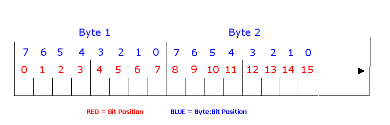

# Understanding Bit and Byte : Bit Positions

When decoding signals, you can specify bit positions in two ways. First you can set the bit position which is relative to the first bit of the message, bit 0. Second, you can specify which bit in a particular byte of a message.

To illustrate bit positioning please refer to Figure 1 below. The first two bytes of the message are shown. The Bit Position is shown in red. The Byte : Bit position is specified in blue. For example, Byte 2 : Bit 5 is the same as bit position 10.

