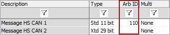

# Message Arbitration ID

The ArbID column is where you enter the Arbitration ID for a CAN Message.It is displayed in hexadecimal format.\
\
The ArbID can use the Standard 11 bit or Extended 29 bit formats depending what [Type](https://cdn.intrepidcs.net/support/VehicleSpy/spyInMsgType.htm) is chosen for the message.\
\
An 11 bit ArbID will range from $000 to $7FF. (3 characters wide)\
\
A 29 bit ArbID will range from $00000000 to $1FFFFFFF. (8 characters wide)

