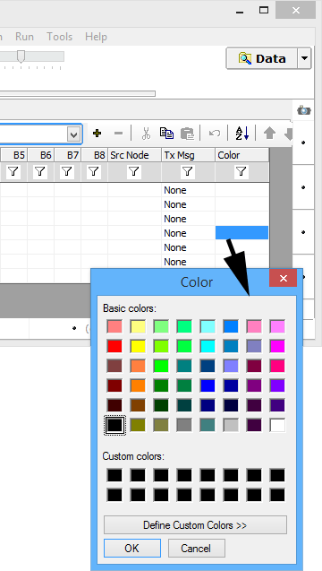

# Message Color

Specify a color for a message as shown in **Figure 1**. This color will be visible in Messages view when the message gets identified by Vehicle Spy.

The color can also be selected from a predefined pulldown list in the setup area below the spreadsheet. Black is the default color if nothing is chosen.

