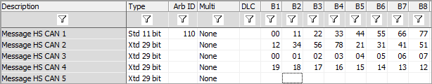
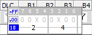

# Message Data Bytes

Columns B1 to B8 can specify the message data bytes directly (Figure 1).

The message data bytes also have unique setup options in the Receive vs Transmit tables.

### Receive Table

Vehicle Spy supports advanced pattern matching of incoming messages. In the Receive table, B1-B8 can have "don't care" symbols (X) at three different levels:

* Byte - leave the cell blank or enter XX.
* Nibble - enter X for either character in the cell, for example X7 or 3X.
* Bit - select binary format, click desired bits until X's are shown, then hit Enter. (see Figure 2)

For example, if B1 is set to X7 then receive messages with B1 = 07, 17, 27...F7 will be identified and decoded. Messages with B1 that do not match the X7 pattern would not be identified or decoded, unless they matched some other row in the Receive table.

### Transmit Table

In the Transmit table, B1-B8 can support long messages that go beyond the data fields provided.
