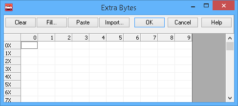

# Transmit Long Messages

Some protocols, like Keyword 2000, ISO15765-2, and J1939, may require you to enter messages that are much longer what is available in the Messages Editor spreadsheet. In older Vehicle Spy versions, enter these longer message by going to the Messages Editor Transmit table and double clicking on a data byte. Select **Long Msg...** from the drop down (Figure 1). This will open the Extra Bytes dialog (Figure 2).

From this dialog, you can enter up to 4100 bytes.

