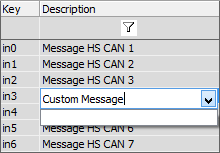

# Message Description

The Message description allows a user friendly name to be assigned to a message. This description will appear in selection dialogs as well as when the message is seen in the Messages view and in the Expression Builder.

Type the desired message description directly into the description field.

