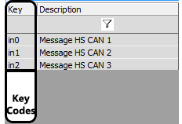

# Message Key

A Key is automatically assigned by Vehicle Spy to every message in the spreadsheet as shown in Figure 1. Every Key is unique and is a read only field in the Messages Editor. The Keys allow Vehicle Spy to uniquely identify each message instead of using their text descriptions which could duplicate each other.

