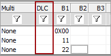

# Message Length

The **DLC** (Data Length Code) allows specification of the expected length for a CAN message (Figure 1).

Likewise, the Len column specifies the length for a LIN message.

When a message is received, its length is compared to the expected message length. If it doesn't match, the global error and expected length bits will be set in the message status field. Vehicle Spy will indicate an error by showing a red dot next to the message in Messages view.

Leave the length column blank to disable length checking.
