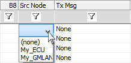

# Message Source Node

Specify the source (or ECU) a particular message belongs to by using the Src Node column in Messages Editor view (Figure 1).

Double click in the Src Node column and select the appropriate node from the dropdown list. The list is automatically populated by the [ECUs](../../ecus-view/) you have defined for the currently selected network.

