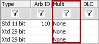

# Multiframe Message

Double click the **Multi** field (Figure 1) to specify if a message will be a multiframe message. The three choices are:

* None - A normal message.
* ISO15765-2 - A multiframe ISO15765-2 [transmit](transmit-iso15765-2-multiframe-message.md) or [receive](receive-iso15765-2-multiframe-message.md) message.
* J1939 - A multiframe J1939 message.

