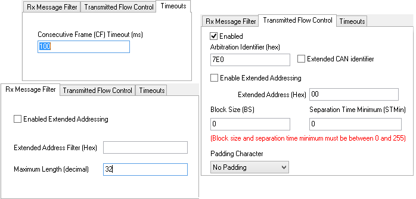

# Receive ISO15765-2 Multiframe Message

Vehicle Spy has the ability to transmit and receive multiframe messages using the ISO15765-2 specification for CAN networks. The first few steps for setting up a receive multiframe message are the same as setting up a normal message. Set the Description, Type, Arbitration ID, and color in the Messages Editor Receive table. After that, ISO15765-2 needs to be selected from the Multi column. This tells Vehicle Spy to use the ISO15765-2 protocol for receiving this message.

In the message setup area, click the **Multiframe Setup** button. A dialog opens for configuring the flow control frame parameters (Figure 1).

**Rx Message Filter tab:** Enables and sets up Extended addressing. The "Maximum Length" option is used with CoreMini. This lets the hardware know how many bytes to expect. This value does not need to be the exact value, but should be the correct size or larger than what you are expecting back in terms of data bytes.

**Transmitted Flow Control tab:** Sets the flow control frame Arb ID, block size, STmin, and padding value.

* Block Size (BS) - requested number of frames to send per block between flow control frames (0 = no limit).
* Separation Time Minimum (STmin) - requested minimum separation time between each frame in a block (0 = send as fast as possible).
* Padding Character - value used to pad the flow control frame out to 8 data bytes long.

Examples:\
Arb ID = 7E0, BS = 0, STmin =  0, Padding = none ==> flow control frame $7E0 30 00 00 (default).\
\
Arb ID = 777, BS = 5, STmin = 100, Padding = BB ==> flow control frame $777 30 05 64 BB BB BB BB BB.

**Timeouts tab:** Determines how long to wait between incoming frames before giving up. The Consecutive Frame Timeout is the maximum time allowed between consecutive frames in a block. If the timeout is exceeded, Vehicle Spy will stop the multiframe exchange by no longer sending flow control frames.

