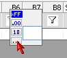
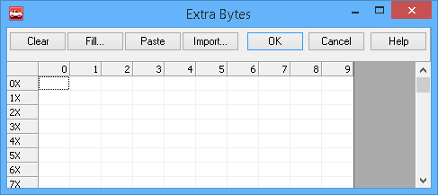
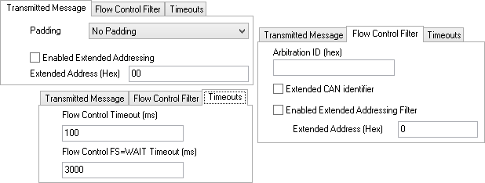

# Transmit ISO15765-2 Multiframe Message

Vehicle Spy has the ability to transmit and [receive](receive-iso15765-2-multiframe-message.md) multiframe messages using the ISO15765-2 specification for CAN networks.The first few steps for setting up a transmit multiframe message are the same as setting up a normal message. Set the Description, Type, Arbitration ID, and color in the Messages Editor Transmit table. After that, ISO15765-2 needs to be selected from the [Multi](./) column. This tells Vehicle Spy to use the ISO15765-2 protocol for sending this message. Next, enter in the data bytes B1 to B7. PCI (Protocol Control Information) bytes do not need to be entered in the data byte fields. An example of the **PCI bytes** are below.

Frame 1 -> ArbID 123 Data bytes: **10 0A** 01 02 03 04 05 06\
Frame 2 -> ArbID 123 Data bytes: **21** 07 08 09 0A

The bold underlined bytes in the above example are the PCI bytes. Vehicle Spy is smart enough to enter PCI bytes by itself. All that needs to be entered for the example is 01 02 03 04 05 06 07 08 09 0A. All bytes past B7 get entered in using the "Long Msg" option shown in Figure 1. This is accessible by double clicking on B8 and clicking the down arrow. Selecting "Long Msg" opens the dialog shown in Figure 2 where up to 4100 more data bytes can be entered.

To continue setting up the multiframe transmit message, click the "Multiframe Setup" button in the message setup area. This will open the setup dialog shown in Figure 3.

**Transmitted Message tab:** Configures padding and enables and sets up Extended addressing.

**Flow Control Filter tab:** Sets the flow control frame Arbitration ID that Vehicle Spy should expect before sending the rest of the message. If nothing is specified then any flow control frame can maintain the multiframe transmission.

**Timeouts tab:** The "Flow Control Timeout" tells Vehicle Spy how long to wait for the flow control frame before giving up. If the timeout is exceeded, Vehicle Spy will stop trying to send the multiframe message data. The "Flow Control FS=Wait Timeout" determines how long Vehicle Spy will wait for the flow control frame following a flow control wait command.

