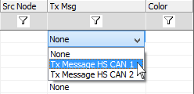

# Receive Message "Tx Msg" Field

Use the **Tx Msg field** to link a Transmit Message to a Receive Message. This link is very useful for simulation because Vehicle Spy will automatically transmit a message based upon an incoming message.

### Automatically Responding To a Received Message

First, enter the message you wish to transmit in the Transmit table in Messages Editor view. (Vehicle Spy automatically adds the transmit message to the dropdown list in the Tx Msg column over on the Receive table.)

Next, go to the Receive table and find or build your incoming message.

Lastly, link the receive message to the transmit message using the Tx Msg dropdown list (Figure 1). The transmit message is now automatically triggered by incoming messages that match that message row in the Receive table.

