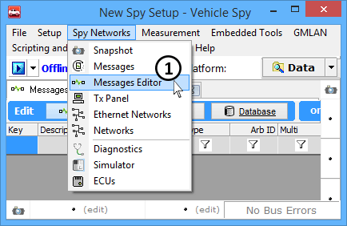
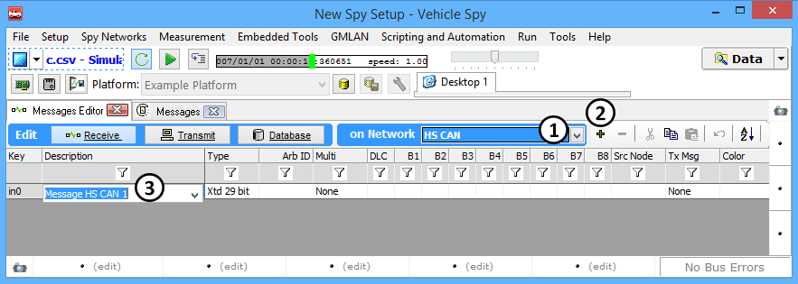
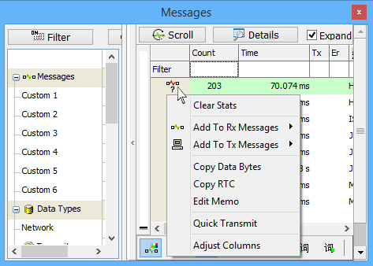
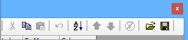

# Messages Editor: Overview

Messages Editor is where messages to be found in traffic are specified, which messages to transmit are specified, and to view definitions from configured databases. Each message has a number of different properties that can specify for it.

To access Messages Editor select **Spy Networks> Messages Editor** from the Main Menu (Figure 1: ).

In the Messages Editor, messages can be added from any network. Select the desired network from the dropdown (Figure 2:), click **+** (Figure 2:), and then type in the message description (Figure 2:).

When in the Messages view you can add messages to a table (Figure 3). Simply select any message, right click on its icon, and add it to the desired table (Rx for receiving or Tx for transmitting). Messages and signals can even be loaded from a Database.

The Messages Editor grid has many typical spreadsheet features including: clipboard operations, undo, and sorting. These tools can be found in the toolbox along the top of Messages Editor view (Figure 4). Many of these features are also supported with a handy right click menu.

