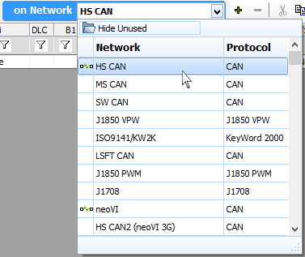

# Messages Editor: Pick a Network

Each [Network](../networks/) has different [Messages and Signals](./). The Network the Messages Editor table is referring to is specified by the **On Network** drop down located at the top of Messages Editor view (Figure 1). Changing this dropdown will show the messages for this network.

The  icon identifies networks with messages in the Receive, Transmit, or Database table. Networks that do not have that symbol, do not have any message defined.

