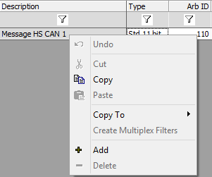

# Messages Editor: Right Click Menu

In the [Messages Editor](messages-editor-overview.md) spreadsheet a right click will give access to [clipboard operations](messages-editor-cut-copy-and-paste.md) and [add and delete](add-and-delete-messages.md) features. A convenient **Copy To** menu allows a quick copy/paste of messages to the Receive or Transmit tables with one click.

