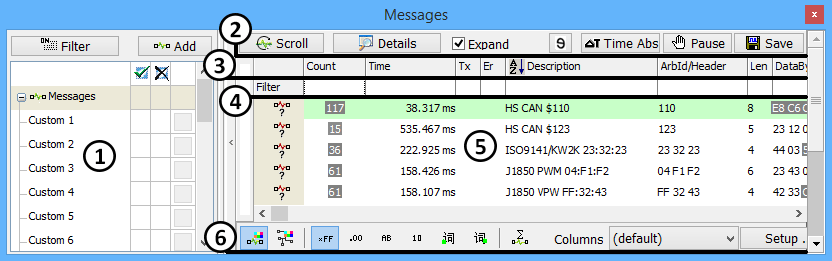

# Messages View

Messages view displays the messages Vehicle Spy has transmitted or received. It is accessed via **Spy Networks** **> Messages** found in the main menu. Messages view has 2 main modes: static and scrolling. In static mode, Messages view displays the latest version of a message that has appeared in the traffic. Changing data bytes are highlighted with gray activity highlighting for easy recognition. In scrolling mode, Messages view displays every instance of all the messages in the traffic. This is shown as a scrolling list with the latest message at the bottom of the display and older messages above.

Messages view uses a circular buffer that collects a user defined number of messages. The default used for new setup files is 50,000 messages. After filling the buffer, the Messages view throws away the oldest messages to make room for new messages. Messages view even shows how full a buffer is and how fast the buffer is filling.

Messages view maintains two circular buffers. One buffer is unfiltered which means it captures every message. The other buffer is filtered and it collects messages that pass the filter.

It is possible to save the buffer for later analysis. It is also possible to clear the buffer to only capture new data. Also, since only a certain number of messages are visible at once, the buffer can be paused and reviewed.

The data displayed in the Messages view can be completely customized. Custom column sets can be created to display just useful information. Messages with signal decoding information can be expanded to list the signal information underneath the message. Colors can even be specified for networks and messages.

Refer to **Figure 1** and **Table 1** for a breakdown of the Messages View.

**Table 1: Messages View area description.**

| Messages View Area                                                                   | Description                                                                                                         |
| ------------------------------------------------------------------------------------ | ------------------------------------------------------------------------------------------------------------------- |
|  Filter Bar       | Quickly filters by network, message, or data type.Complex filter combinations are supported.                        |
|  Top Toolbar      | Tools for scroll/static mode, absolute/relative timestamps, saving a buffer, finding a message, and many more.      |
|  Column Headers | Columns describe important message parameters and can be sorted. Predefined and custom column setups are supported. |
|  Column Filters  | Uses pattern matching techniques to filter all data in a column.                                                    |
|  Buffer Display  | Displays messages and their signals. Includes a buffer progress bar and task menus.                                 |
|  Bottom Toolbar   | 
Tools for color, display format, statistics mode, and column setup. 
                                      |
