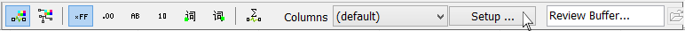

# Messages View Bottom Toolbar

The toolbar located along the bottom of [Messages view](../) is shown in **Figure 1**.

Refer to **Table 1** for details on the various toolbar selections.

**Table 1: Messages View Bottom Toolbar Selections**

| Toolbar Selection                                             | Description                                                                                                                                                                                                                                                                                                                                                                                                                                                                                  |
| ------------------------------------------------------------- | -------------------------------------------------------------------------------------------------------------------------------------------------------------------------------------------------------------------------------------------------------------------------------------------------------------------------------------------------------------------------------------------------------------------------------------------------------------------------------------------- |
| [Message & Network Color](color-filters.md) buttons           | These two buttons on the left toggle between Message and Network color modes.                                                                                                                                                                                                                                                                                                                                                                                                                |
| [Data Byte Format](messages-view-data-byte-format.md) buttons | These six buttons in the middle apply a format like hexadecimal or decimal to the DataBytes and Arb ID/Header columns.                                                                                                                                                                                                                                                                                                                                                                       |
| Statistics button                                             | 
When enabled, the following statistics are shown along a row below each message: 
<ul><li>Min - minimum relative time between messages.</li><li>Max - maximum relative time between messages.</li><li>Mean - mean relative time between messages.</li><li>StdDev - standard deviation of the relative time between messages.</li><li>Start - absolute time the first message was received.</li><li>Change Count - number of times the data bytes changed in that message.</li></ul> |
| [Columns](../messages-view-column-headers.md) dropdown list   | Selects a set of column headers.                                                                                                                                                                                                                                                                                                                                                                                                                                                             |
| [Setup](messages-view-setup.md) button                        | Opens a dialog to let you create new column sets. You can also adjust the message buffer size and message Recent Time.                                                                                                                                                                                                                                                                                                                                                                       |
| Review Buffer button                                          | Click the folder button to select a buffer file to review. This is exactly the same as the File> \*\*\*\* Review Buffer feature.                                                                                                                                                                                                                                                                                                                                                             |
