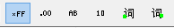

# Messages View Data Byte Format

Six format buttons are located in the [bottom toolbar](./) of [Messages view](../) (Figure 1).These buttons allow for quick, one-click formatting of the DataBytes, Arb ID/Header, and J1939 PGN [columns](../messages-view-column-headers.md).\
The six buttons pictured below (from left to right) are: Hexadecimal, Decimal, ASCII, Binary, Unicode Big Endian, and Unicode Little Endian.

The DataBytes column supports all six formats, but other columns have special cases as follows:

* Arb ID/Header - will use the hex format if ASCII or either unicode format is selected.
* J1939 PGN - remains decimal even if hex format is selected.
* J1939 PGN (Hex) - displays hex OR decimal depending upon the format selection.

This format selection does NOT affect the contents of saved buffers. Saved buffers always use the hexadecimal format.
