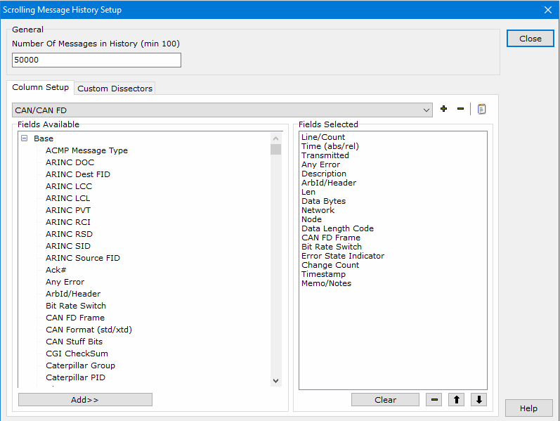

# Messages View Setup

Setup Messages view by clicking the **Setup** button (Figure 1) in the bottom toolbar. A setup dialog will open.

The setup dialog (Figure 2) is divided into two areas labeled **General** and **Column Setup**.

### General Area Dialog

The **Number of Messages in History** specifies how many messages Vehicle Spy can collect before rolling over and overwriting the oldest messages. This setting is used by the buffer progress display bar.

For example, assume the buffer is 10,000 messages. When message 10,001 is received then message 1 is discarded. For much more flexible buffer collection see the Function Blocks feature of Vehicle Spy. The Messages view buffer size is only adjustable when Vehicle Spy is offline.

### Column Setup Dialog

For more information on setting up a custom column set, please click here.

