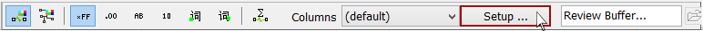
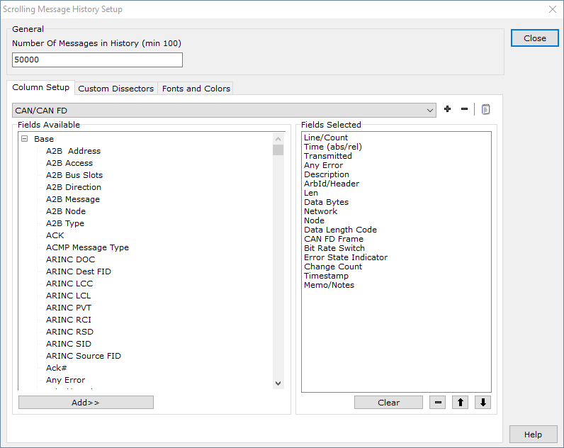
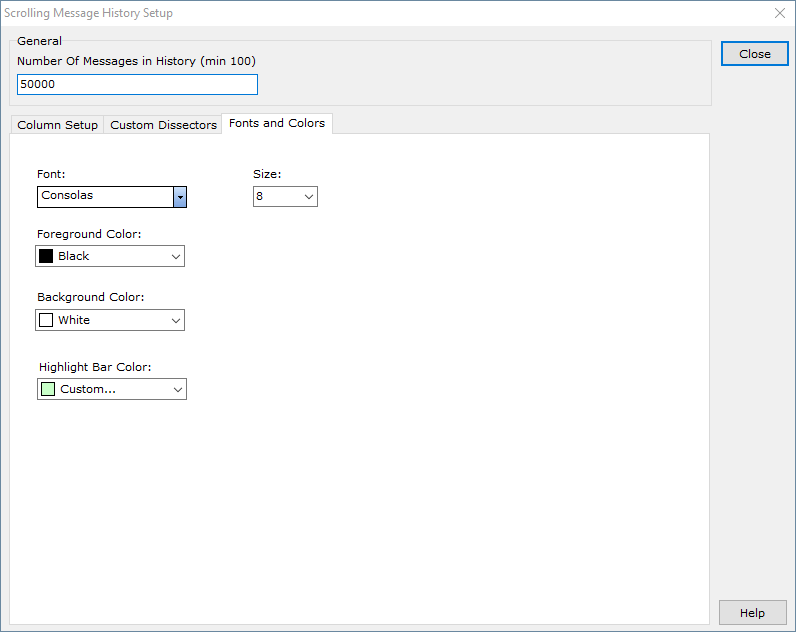

# Messages View Setup

Setup [Messages view](../) by clicking the **Setup** button (Figure 1) in the [bottom toolbar](./). A setup dialog will open.

The setup dialog (Figure 2) is divided into an area labeled **General**, as well as a tabbed area with three different tabs: **Column Setup**, **Custom Dissectors**, and **Fonts and Colors**.

### General

The **Number of Messages in History** specifies how many messages Vehicle Spy can collect before rolling over and overwriting the oldest messages. This setting is used by the [buffer progress display bar](../messages-view-buffer-display/buffer-progress-display.md).

For example, assume the buffer is 10,000 messages. When message 10,001 is received then message 1 is discarded. For much more flexible buffer collection see the [Function Blocks](../../../main-menu-scripting-and-automation/function-blocks/) feature of Vehicle Spy. The Messages view buffer size is only adjustable when Vehicle Spy is offline.

### Column Setup Tab

For more information on setting up a custom column set, please click [here](../messages-view-column-headers.md).

### Custom Dissectors Tab

Here you can add or remove custom message dissectors written in the Lua scripting language.

### Fonts and Colors Tab

Here you can change the font used for the messages view, as well as the default foreground and background color of the messages view.

* **Font:** Select the desired font.  It is recommended to choose a monospaced font such as Consolas, Courier New, Terminal, or System.  With other fonts, the message bytes will not be properly aligned in the messages view.
* **Size:** Select the desired font size.
* **Foreground Color:** The default text color in the messages view.
* **Background Color:** The default background color for the messages view.
* **Highlight Bar Color:** The default color for the highlight bar in the messages view.

