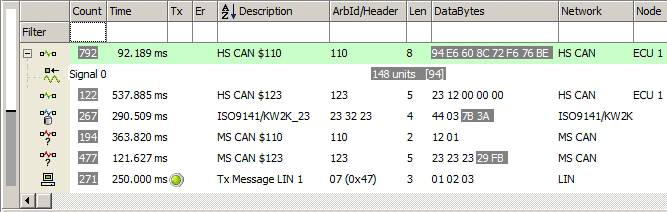

# Messages View Buffer Display

The [Messages view](../) buffer display (Figure 1) is a window into the world of network messages and signals received and transmitted by Vehicle Spy. Toolbars both [above](../messages-view-top-toolbar/) and [below](../messages-view-bottom-toolbar/) the display contain many features to adjust its appearance to fit desired needs.

On the far left side is a [buffer progress display](buffer-progress-display.md) bar that shows how full the buffer is. Next to that are **+/- buttons** that can be clicked to [show or hide signals](displaying-signals-in-messages-view.md) defined within each message.

The following icons indicate data defined in the [Messages Editor](../../message-editor/messages-editor-overview.md):

 Unknown message that is not defined.\
 Receive message.\
 Transmit message.\
 [Database](../../../main-menu-setup/network-databases.md) message.\
 Defined signal.

Clicking on an icon opens a convenient [task menu](messages-view-task-menus.md) for performing common tasks quickly.

Clicking in the main display area highlights the entire row in green for easy reading. Activity highlighting helps pinpoint changing data. Gray indicates fast changing data (rate <= 1s). Blue indicates slow changing data (rate > 1s). Data that stops changing gradually has its highlighting fade to white.

A horizontal scrollbar lets you see any [columns](../messages-view-column-headers.md) hidden from view. A vertical scrollbar lets you see messages hidden from view in static mode or review message history while [paused](../messages-view-top-toolbar/pause-messages-view.md) in scrolling mode.

Please check the following video for more details.



