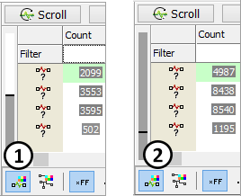

# Buffer Progress Display

Messages view uses a circular buffer. This means that when the buffer is full, the oldest data in the buffer is overwritten. Therefore, if you setup a buffer of 1000 messages, you will always have the 1000 most recent messages in your buffer.

The Buffer Progress Display (Figure 1) shows how full your buffer is and if it has overflowed. For example, with a buffer of 1000 messages, an overflow happens every time 1000 messages have been written to the buffer.

The current position in your buffer is shown as a black pointer. The gray level is how full the buffer is. In **Figure 1:**  notice a buffer is starting to be filled. In **Figure 1:**  the buffer has overflowed.

