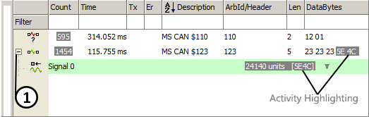

# Displaying Signals in Messages View

Messages view displays message traffic, but it can also display the signals within each message.

Messages that contain defined signals have a +/- button located just to the right of the buffer progress display (Figure 1:). Simply click on the **+** (it will turn into a -) and the associated signals will appear below the message.

Notice that activity highlighting present in the message DataBytes is applied to changing signal values as well. Gray indicates fast changing data (<= 1s) and blue indicates slow changing data (> 1s).

Also notice a small up/down arrowhead next to the signal indicates if the data has increased or decreased from the last time it was received.

