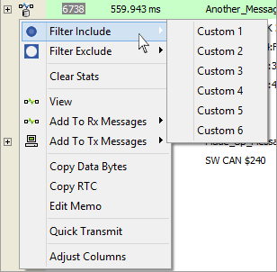
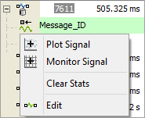

# Messages View Task Menus

In the [Messages view](../), clicking on icons located just left of the main display area opens convenient menus for performing common tasks. The menu selections differ depending upon which object is clicked.

### Message Task Menu

Click on a database message icon () to see the menu shown in **Figure 1**. A [database](../../../main-menu-setup/network-databases.md) message is one that has matched a row on the Database table in the [Messages Editor](../../message-editor/). Similar menu selections will appear by clicking on the icons for received messages (), transmit messages (), or any undefined mystery messages ().

The message task menu selections are straightforward.

* Filter Include/Exclude - opens a sub-menu with a list of all [Custom Filters](../messages-view-filter-bar/messages-view-custom-filters.md). Just select one of the custom filters and that message is immediately added to the Include or Exclude list for that filter.
* Clear Stats - is similar to the function block [Clear Stats command](../../../main-menu-scripting-and-automation/function-blocks/function-blocks-types/script-type-function-block-commands/script-type-function-block-command-clear-stats.md) on the message, except it works on all message types.
* Edit - opens the message definition in the corresponding [Messages Editor](../../message-editor/) table. This can be a big time saver compared to locating a message definition by searching through large tables.
* Add to Rx/Tx Messages - adds the message to the corresponding table in the Messages Editor. Another big time saver versus the user typing the information (and no chance of accidental typos).
* Copy Data Bytes/RTC - acquires the selected messages data bytes or RTC clock time and adds it to the Windows clip board.
* Quick Transmit - takes the selected message and sends it out. The same ID and data bytes that were received are sent out.

### Signal Task Menu

Click on a signal icon () to see the menu shown in Figure 2. Here is a summary of the signal task menu selections:

* Plot Signal - opens the [Signal Plot](../../../main-menu-measurement/signal-views/signal-plot.md) view with the signal added to the y-axis.
* Monitor Signal - opens the [Signal List](../../../main-menu-measurement/signal-views/signal-list.md) view with the signal added in the list.
* Clear Stats - clears all signal properties (see [Expression Builder](../../../../shared-features-in-vehicle-spy/shared-features-expression-builder.md)) for the selected signal.
* Edit - opens the signal definition in the Messages Editor. This can be a big time saver compared to locating a specific signal definition by searching through large tables.

