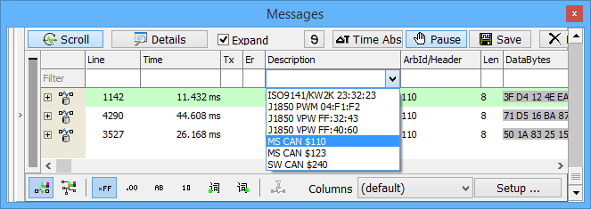

# Messages View Column Filters

### Overview

In addition to the [Filter Bar](messages-view-filter-bar/), the [Messages view](./) can be filtered further with column filters. Column filters affect the display and the contents of saved buffer files, just like the Filter Bar does. They are also turned on and off using the **Filter** button at the top of the Filter Bar.

Column filters are located in the row of blank fields just below the [column headers](messages-view-column-headers.md) as seen in **Figure 1**. The black/gray Filter text at the far left of that row indicates the Filter button status.

Column filters provide a fast and efficient way to sort through hundreds of messages without setting up a custom filter. Each column has its own filter and multiple columns can be filtered at the same time. Vehicle Spy supports two methods of column filtering.

### Column Filters Using the Pulldown List

Pulldown list column filter selections are automatically created by Vehicle Spy as a buffer is collected. To access the list, click three times in the blank field below the column header you want to filter. Then click the arrow to see the pulldown list filter selections like that shown in the Description column in **Figure 1**. The list contains every unique data item in that column. Click on one of the filters and press **Enter**\*. The filter name fills the space under the column heading and only messages matching that filter are shown.

### Column Filters Using the Entry Field

Imagine for a moment working with hundreds of messages. The specific message desired has an arbitration ID with a 6 in it, but the actual number has been forgotten. Simply type **6** in the blank field beneath the **Arb ID** column heading and press **Enter**\*. Only messages with an Arb ID that includes a 6 are visible such as 640, 126, and 260.

For another example, imagine knowing a desired arbitration ID begins with a 1. Simply enter in **1??** and Vehicle Spy shows all three digit Arb IDs beginning with the number 1 like 110 and 123.

To include more than one message in a filter, separate them using a comma like **?2?, 110, ?33**. These column filters work on other columns as well. When working with a database and all messages and signals are defined, enter **eng** or **odo** in the blank field below the **Description** header. Only messages and signals with those letters in their descriptions, those pertaining to engine and odometer, will remain.

### Applying, Deleting, and Disabling Column Filters

\*To apply a column filter while offline, after pressing Enter, make sure to click in the main display area to see it take effect.

To delete a column filter, click and highlight it, then press the **Delete** key and **Enter** key to confirm.

To disable all column filters without changing them, use the **Filter** button above the [Filter Bar](messages-view-filter-bar/). The Filter text and column filter names will fade to gray when they are disabled.
