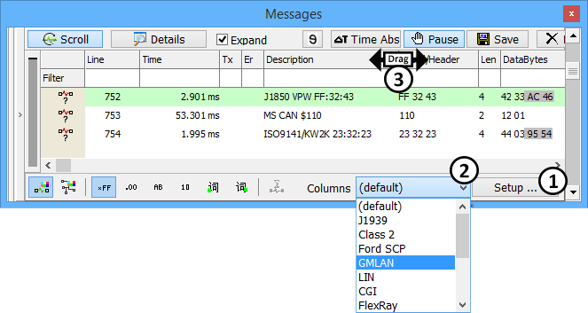
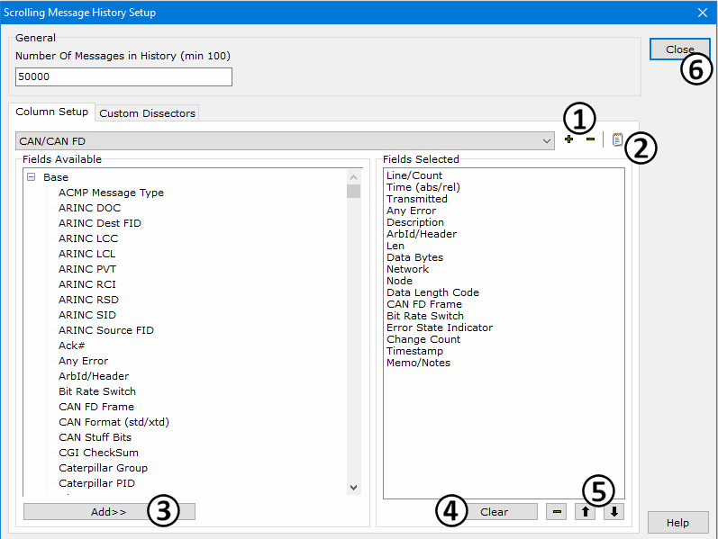

# Messages View Column Headers

### Overview

The columns visible in [Messages view](./) can be defined by the user. Vehicle Spy displays the default column set on initial start up. Select other column sets from the dropdown at the bottom of Messages view (Figure 1:). Create custom column sets by clicking the **Setup** button (Figure 1:). Custom column sets are saved with your Vehicle Spy setup file. No need to recreate them each time Vehicle Spy is used.

Column sets do NOT affect the contents of saved buffers. Saved buffers always contain a standard set of columns that can not be changed.

### Column Actions

Figure 1 shows columns as seen in the Messages view. Click and drag on column dividers to resize them (Figure 1:).

Columns can be sorted to quickly organize the display. If sorting while in scrolling mode, make sure to [Pause](messages-view-top-toolbar/pause-messages-view.md) the view first. To sort any column while online, just click on a column header to sort descending (A-Z), ascending (Z-A), or by order received on the bus. To sort while offline, click on a column header then click in the main display area. Only one column can be sorted at any given time.

### Custom Column Sets

Custom column sets are a great tool for increasing efficiency. For example, you can create different column sets that you can quickly scroll through to see different types of information about a message. Use the Columns dropdown list (Figure 1:) to select predefined column sets. Press the **Setup** button (Figure 1:) to build your own column set to add to the dropdown list.

### Setting Up The Columns

If you press the **Setup** button (Figure 1:), the setup dialog in Figure 2 will open. For more information on the General settings, please click [here](messages-view-bottom-toolbar/messages-view-setup.md).

Click the **+ button** (Figure 2:) to create a new Column Setup. Click the **edit button** (Figure 2:) to change the name of the new Column Setup. All possible column selections to choose from are listed in the **Fields Available** area on the left and are described in **Table 1** below. To add columns to a setup, select an item in the list and click the **Add>>** button (Figure 2:) or just double click on the item.

All columns currently in your setup are displayed in the **Fields Selected** area on the right. Use the **Clear** and **- buttons** (Figure 2:) to clear the entire list or remove selected items one at a time. Individual items in this area can also be removed by just double clicking on them. Use the up/down arrow buttons (Figure 2:) to shift items up and down within the Fields Selected list.

When you are finished building a Column Setup, click **Close** (Figure 2:) to return to Messages view. Make sure to [save the vs3 or vs3zip file](../../main-menu-file/create-open-and-save-vehicle-spy-setups.md) to save the new Column Setup.

**Table 1: Data columns Available on Messages view.\\**

| Column Name              | Column Header          | Description                                                                                                                                                                                                                                                                                                               |
| ------------------------ | ---------------------- | ------------------------------------------------------------------------------------------------------------------------------------------------------------------------------------------------------------------------------------------------------------------------------------------------------------------------- |
| Any Error                | Er                     | If this message has an error a red dot appears in this column.                                                                                                                                                                                                                                                            |
| Arb ID/Header            | ArbID/Header           | The CAN Arb ID or the first three message bytes if the message is not CAN. Can be displayed in hex, decimal, or binary data byte formats.                                                                                                                                                                                 |
| CAN Format (std/xtd)     | Frmt                   | Shows if the CAN header format is 11 bit (standard) or 29 bit (extended).                                                                                                                                                                                                                                                 |
| CGI Checksum             | CGI CheckSum           | The checksum of CGI messages.                                                                                                                                                                                                                                                                                             |
| Change Count             | ChangeCnt              | Counts the number of times the Data Bytes changed in that message while in Static mode.                                                                                                                                                                                                                                   |
| Class 2 C Bit            | C                      | The state of the GM Class 2 C bit.                                                                                                                                                                                                                                                                                        |
| Class 2 Msg Type         | Msg Type               | The GM Class 2 message type: RACK, LOAD, RPT, etc.                                                                                                                                                                                                                                                                        |
| Class 2 Q Bit            | Q                      | The state of the GM Class 2 Q bit.                                                                                                                                                                                                                                                                                        |
| Data Bytes               | DataBytes              | The message data bytes in the selected [data byte format](messages-view-bottom-toolbar/messages-view-data-byte-format.md).                                                                                                                                                                                                |
| **Description**          | **Description**        | **The description of the message if it can be identified.**                                                                                                                                                                                                                                                               |
| FlexRay Channel          | Ch                     | The FlexRay channel (A or B) the frame is on.                                                                                                                                                                                                                                                                             |
| FlexRay CRC              | CRC                    | Checksum of the entire FlexRay frame.                                                                                                                                                                                                                                                                                     |
| FlexRay Cycle Count      | Cyc Cnt                | The cycle number the FlexRay frame is in.                                                                                                                                                                                                                                                                                 |
| FlexRay Header CRC       | HCRC                   | Checksum of the FlexRay header only.                                                                                                                                                                                                                                                                                      |
| FlexRay Is Dynamic       | Dyn                    | 
Indicates if the FlexRay frame is static or dynamic. N = static frame. Y = dynamic frame.
                                                                                                                                                                                                                    |
| FlexRay NULL bit         | NULL                   | 
FlexRay Null frame indicator. 0 = payload contains no valid data. 1 = payload contains data.
                                                                                                                                                                                                                 |
| FlexRay PPI bit          | PPI                    | 
FlexRay Payload Preamble Indicator bit indicates if further structure exists in the payload. This structure is for network management in a static frame or a message ID in a dynamic frame.  0 = payload has no further structures defined. 1 = payload has network management or message ID information.
 |
| FlexRay Res bit          | Res                    | Reserved bit for future use in FlexRay frames.                                                                                                                                                                                                                                                                            |
| FlexRay Start bit        | Strt                   | 
FlexRay Startup frame indicator. 0 = frame is not a startup frame. 1 = frame is a startup frame.
                                                                                                                                                                                                             |
| FlexRay Sync bit         | Sync                   | 
FlexRay Synchronization frame indicator. 0 = frame is not a synchronization frame. 1 = frame is a synchronization frame.
                                                                                                                                                                                     |
| FlexRay TSS Length       | TssLen                 | Transmission Start Sequence length of the FlexRay frame (nanoseconds).                                                                                                                                                                                                                                                    |
| GMLAN Parameter ID       | ParaID                 | The Parameter ID from a GMLAN message with a 29 bit header.                                                                                                                                                                                                                                                               |
| GMLAN Priority           | Prior                  | The priority from a GMLAN message with a 29 bit header.                                                                                                                                                                                                                                                                   |
| GMLAN Src Addr           | Src                    | The Source Address from a GMLAN message with a 29 bit header.                                                                                                                                                                                                                                                             |
| J1850 IFR/SCP Ack Bytes  | Ack Bytes              | J1850 In-Frame Response or Ford SCP acknowledge bytes.                                                                                                                                                                                                                                                                    |
| J1850 Priority           | Priority               | The priority of a J1850 message (first three bits).                                                                                                                                                                                                                                                                       |
| J1939 DP                 | DP                     | Data Page section of the 29 bit CAN Arb ID according to SAE J1939.                                                                                                                                                                                                                                                        |
| J1939 Dst                | Dst                    | Destination Address or Group Extension section of the 29 bit CAN Arb ID according to SAE J1939.                                                                                                                                                                                                                           |
| J1939 PDU                | PDU                    | Protocol Data Unit of the 29 bit CAN Arb ID according to SAE J1939.                                                                                                                                                                                                                                                       |
| J1939 PGN                | PGN                    | Parameter Group Number (decimal) of the 29 bit CAN Arb ID according to SAE J1939. Remains decimal even if Hex Format is selected for the [data byte format](messages-view-bottom-toolbar/messages-view-data-byte-format.md).                                                                                              |
| J1939 PGN (Hex)          | PGN (Hex)              | Parameter Group Number (hex) of the 29 bit CAN Arb ID according to SAE J1939. Displays hex OR decimal depending upon the [data byte format](messages-view-bottom-toolbar/messages-view-data-byte-format.md).                                                                                                              |
| J1939 Priority           | Prior                  | Priority section of the 29 bit CAN Arb ID according to SAE J1939.                                                                                                                                                                                                                                                         |
| J1939 R                  | R                      | Reserved bit of the 29 bit CAN Arb ID according to SAE J1939.                                                                                                                                                                                                                                                             |
| J1939 Src                | Src                    | Source Address of the 29 bit CAN Arb ID according to SAE J1939.                                                                                                                                                                                                                                                           |
| J2602 Slave Error Status | SlvStatus              | Reports errors found in the J2602 protocol.                                                                                                                                                                                                                                                                               |
| Len                      | Len                    | Number of data bytes in the message.                                                                                                                                                                                                                                                                                      |
| LIN Checksum             | ChkSum                 | The checksum for the LIN message.                                                                                                                                                                                                                                                                                         |
| LIN Header Tx            | Txh                    | Marks LIN Messages that were transmitted.                                                                                                                                                                                                                                                                                 |
| LIN Slave Tx             | TxS                    | Indicates that the Slave portion of a LIN message was sent.                                                                                                                                                                                                                                                               |
| LIN/FRAY TFrame Time     | TFrame                 | Time from the start of frame until the end of frame in microseconds. Valid for LIN or FlexRay networks.                                                                                                                                                                                                                   |
| Line / Count             | Count                  | Gives the number of messages from that ID in Static mode and the message count in Scrolling mode.                                                                                                                                                                                                                         |
| Lost Arbitration         | Lost Arb               | Tells if a message has lost arbitration.                                                                                                                                                                                                                                                                                  |
| MOST ACK                 | ACK                    | MOST25 message acknowledge. MOST = Media Oriented Systems Transport.                                                                                                                                                                                                                                                      |
| MOST CACK                | CACK                   | Complete acknowledge in a MOST50 message.                                                                                                                                                                                                                                                                                 |
| MOST Function Block ID   | FBlockID               | Function block identifier. Functional address of an FBlock = FBlockID + InstID.                                                                                                                                                                                                                                           |
| MOST Function ID         | FktID                  | Function identifier within the function block.                                                                                                                                                                                                                                                                            |
| MOST Instance ID         | InstID                 | Function block instance identifier. Functional address of an FBlock = FBlockID + InstID.                                                                                                                                                                                                                                  |
| MOST Message Type        | Msg Type               | Message type of a MOST25 message.                                                                                                                                                                                                                                                                                         |
| MOST Operation Type      | OPType                 | Operation type to be applied to the function in a MOST message.                                                                                                                                                                                                                                                           |
| MOST PACK                | PACK                   | Preliminary acknowledge in a MOST50 message.                                                                                                                                                                                                                                                                              |
| MOST Priority            | Priority               | Priority of a MOST50 message.                                                                                                                                                                                                                                                                                             |
| MOST Protocol            | Protocol               | Decodes the MOST protocol type.                                                                                                                                                                                                                                                                                           |
| MOST Source Address      | Source                 | Source address of a MOST message.                                                                                                                                                                                                                                                                                         |
| MOST Target Address      | Target                 | Target address of a MOST message.                                                                                                                                                                                                                                                                                         |
| MOST Telegram ID         | TelID                  | Telegram identifier in a MOST message.                                                                                                                                                                                                                                                                                    |
| MOST Telegram Length     | TelLen                 | The number of bytes per MOST telegram.                                                                                                                                                                                                                                                                                    |
| Network                  | Network                | The name of the network the message is on.                                                                                                                                                                                                                                                                                |
| Node                     | Node                   | The Node (ECU) name assigned to the message.                                                                                                                                                                                                                                                                              |
| RTC Time                 | RTC Time               | Real Time Clock stamp placed on the message if supported by connected ICS hardware. Use [Regional Settings](../../main-menu-tools/tools-options/options-regional-settings.md) to change its format.                                                                                                                       |
| SCP Msg Type             | Msg Type               | The Ford SCP message type: Node-To-Node, Functional, etc.                                                                                                                                                                                                                                                                 |
| Signals                  | Signals                | Comma separated list of the signals for each message in the format Signal1 = Value1, Signal2 = Value2, etc.                                                                                                                                                                                                               |
| Status/Err Description   | Status/Err Description | A text description of all the active bits in the Messages Status byte.                                                                                                                                                                                                                                                    |
| Time                     | Time                   | The time in either absolute or relative formats - dependant on the state of the [timestamp button](messages-view-top-toolbar/messages-view-timestamping.md).                                                                                                                                                              |
| Time (abs)               | Time (abs)             | Absolute time since Vehicle Spy was started.                                                                                                                                                                                                                                                                              |
| Time (rel)               | Time (rel)             | Elapsed time from the previous message.                                                                                                                                                                                                                                                                                   |
| Time PC                  | Time PC                | Time of the message in PC time.                                                                                                                                                                                                                                                                                           |
| Transmitted              | Tx                     | If this message was a Tx message a green dot appears in this column.                                                                                                                                                                                                                                                      |
| Value                    | Value                  | ???                                                                                                                                                                                                                                                                                                                       |
