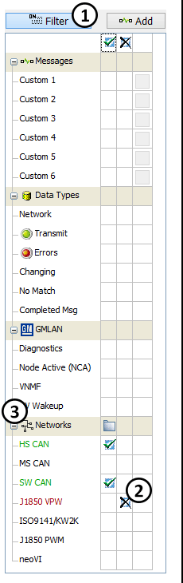

# Messages View Filter Bar

Vehicle Spy offers many ways to filter data.  One of these ways is the **Filter Bar.**\
\
The Filter Bar (Figure 1) is located on the left side of the Messages view.  With just a click you can activate any of Vehicle Spy's standard filters.  Single, multiple, and custom filters are supported.  It is easy to focus on just the information that interests you.\
\
**How it works:**\
\
Vehicle Spy maintains two separate circular buffers for the Messages view.  One of the buffers is unfiltered and contains everything while the other buffer is filtered according to the Filter Bar and any column filter settings.\
\
The Filter Bar can include and exclude messages.  Messages are always excluded first and then included. \
\
For example in **Figure 1**, Vehicle Spy is including HS CAN and SW CAN messages while excluding J1850 VPW messages.\
\
**Turning the filter on and off:**\
&#x20; \
You can turn the Messages view filter on and off by clicking the **Filter** button (Figure 1:) in the top left corner.  Tapping predefined function key **F3 then F** will also work.\
\
When the filter is on, the button is depressed or blue as shown in **Figure 1** and only filtered messages are included in the display and contents of saved buffer files.\
\
When the filter is off, all messages are included in the display and contents of saved buffer files.\
\
**Creating a Filter:**\
\
You can build your filter in the Filter Bar quickly and easily.  Include an item in the Filter Bar by clicking in the first box to the right of the item name.  A check mark will appear () in the box and the item name will turn green.  The check mark means to include that item in the filter.  To exclude an item, click the second box to the right of the item name.  An X will appear () and the item name will turn red.  Clicking on a checkmark or an X a second time will clear the filter selection (Figure 1:).\
\
**Categories of Filters:**\
\
The **+/- toggle buttons** expand and contract all items in a category (Figure 1:).&#x20;

&#x20;**Table 1** describes the major categories in the Filter Bar.

| **Category** | **Description**                                                                                                                                                                                                                                                                                                                                                                                       |
| ------------ | ----------------------------------------------------------------------------------------------------------------------------------------------------------------------------------------------------------------------------------------------------------------------------------------------------------------------------------------------------------------------------------------------------- |
| Networks     | Filters for physical networks.                                                                                                                                                                                                                                                                                                                                                                        |
| Messages     | Powerful custom filters that work on messages, signals, or ECUs.  Custom filters must be included or excluded in the Filter Bar to work.  Click the small gray button to the right of the filter name to setup a custom filter.                                                                                                                                                                       |
| Data Types   | <ul><li>Network - all networks.  This filter is typically included when using exclude filters in the Networks category.</li><li>Transmit - any message transmitted by Vehicle Spy.</li><li>Errors - any message that has an error.</li><li>Changing - any message with data that has changed.</li><li>No Match - any message not found in the Messages Editor.</li><li>Completed Msg - tbd.</li></ul> |
| Other        | 
Filters for specific messages like diagnostics and Management Frames. <strong>Note</strong>: The options shown here must be enabled in the Tools -> Options, Spy Networks tab under OEM Specific Features options to see this category.  The options displayed depend on what option is selected.
                                                                                           |
