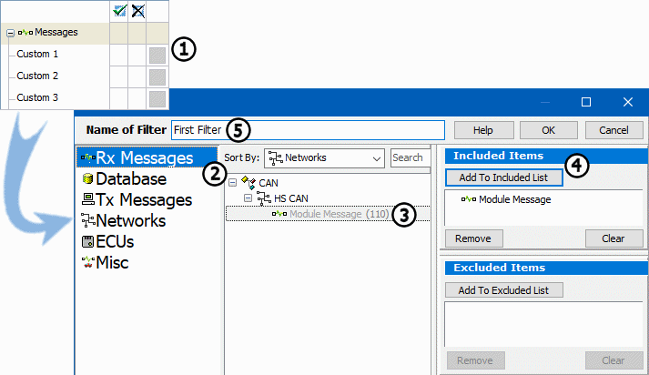

# Messages View Custom Filters

### Overview

Custom filters are filters than can include user defined groups of Messages, ECUs, and [Networks](../../networks/). This group can then be included or excluded in the [Filter Bar](./). [Messages view](../) supports up to 99 custom filters.

### Details

Custom filters are located under the Messages category in the Filter Bar. By default, they are named Custom 1, Custom 2, and so on. Additional custom filters added by clicking the **Add** button at the top of the Filter Bar. To delete a custom filter, right click on it and select **Remove Message Filter**.

As with the other standard filters, clicking in the first column to the right of the filter name activates the filter (). Clicking in the second column to the right reverses the filter ().

Edit the filter by clicking the small gray box in the third column to the right of the custom filter title (Figure 1:). Clicking the box opens the Setup Filter dialog shown in **Figure 1**.

In the Setup Filter dialog, give the filter a custom name by typing in the **Name of Filter field** (Figure 1:). The name entered replaces the default name in the Filter Bar when returning to Messages view. Renaming a filter is especially useful when working with several filters.

Next, define the filter. The first step is to select a data source located just below the Name of Filter heading (Figure 1:). They include: Rx Messages, Database, Tx Messages, Networks, ECUs, and Misc. Details about each data source can be found below in **Table 1**. When selecting a data source from the list, available items (messages, signals, etc.) will be shown in the central window in a tree (Figure 1:).

To add an item to your filter, simply select it from the tree and press the **Add to Included List** button (Figure 1:) or the **Add to Excluded List** button. A filter can contain both included and excluded items. (Double clicking on an item in the tree will automatically add it to the Included Items list.) All items added to a filter will appear in either the Included Items or Excluded Items list. If an item is accidentally added, remove it by selecting the item and pressing the **Remove** button. Clear the entire filter by pressing the **Clear** button.

When the filter is finished, press the **OK** button to automatically return to the Messages view. All that is left is to click in the green checkmark column and activate the filter!

**Table 1: Custom Filter Data Sources**

| Data Source                        | Description                                                                                                                                                                                                                                                                                                                                                                                                                                                                                                                                                                                                                  |
| ---------------------------------- | ---------------------------------------------------------------------------------------------------------------------------------------------------------------------------------------------------------------------------------------------------------------------------------------------------------------------------------------------------------------------------------------------------------------------------------------------------------------------------------------------------------------------------------------------------------------------------------------------------------------------------- |
| Rx Messages, Database, Tx Messages | A list of all messages and signals defined for each network in the [Messages Editor](../../message-editor/) or [Database](../../../main-menu-setup/network-databases.md).                                                                                                                                                                                                                                                                                                                                                                                                                                                    |
| Networks                           | A list of [Networks](../../networks/).                                                                                                                                                                                                                                                                                                                                                                                                                                                                                                                                                                                       |
| ECUs                               | A list of [ECUs](../../../main-menu-setup/ecus-view/) in each network.                                                                                                                                                                                                                                                                                                                                                                                                                                                                                                                                                       |
| Misc                               | 
List of Message properties includes:
<table><thead><tr><th>Name</th><th>Description</th></tr></thead><tbody><tr><td>Network</td><td>Any network message.</td></tr><tr><td>Errors</td><td>Any message that has an error.</td></tr><tr><td>Transmit</td><td>Any transmit Message.</td></tr><tr><td>Any Change</td><td>Any message with data that has changed.</td></tr><tr><td>Length Mismatch</td><td>Any message with length mismatch.</td></tr><tr><td>No Change</td><td>Any message with data that has not changed.</td></tr><tr><td>No Match</td><td>Any message which wasn't identified.</td></tr></tbody></table> |
| Name                               | Description                                                                                                                                                                                                                                                                                                                                                                                                                                                                                                                                                                                                                  |
| Network                            | Any network message.                                                                                                                                                                                                                                                                                                                                                                                                                                                                                                                                                                                                         |
| Errors                             | Any message that has an error.                                                                                                                                                                                                                                                                                                                                                                                                                                                                                                                                                                                               |
| Transmit                           | Any transmit Message.                                                                                                                                                                                                                                                                                                                                                                                                                                                                                                                                                                                                        |
| Any Change                         | Any message with data that has changed.                                                                                                                                                                                                                                                                                                                                                                                                                                                                                                                                                                                      |
| Length Mismatch                    | Any message with length mismatch.                                                                                                                                                                                                                                                                                                                                                                                                                                                                                                                                                                                            |
| No Change                          | Any message with data that has not changed.                                                                                                                                                                                                                                                                                                                                                                                                                                                                                                                                                                                  |
| No Match                           | Any message which wasn't identified.                                                                                                                                                                                                                                                                                                                                                                                                                                                                                                                                                                                         |
