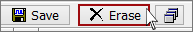

# Clear the Buffer

Clear the Messages view buffer by pressing the **Erase** button on the Messages view top toolbar (Figure 1).Tapping predefined function key **F3 then C** will also work.\
\
Clearing the buffer also resets the buffer progress display and removes any suppression of activity highlighting caused by the Reverse Engineering button.\
\
**Caution**: Clearing the Vehicle Spy message buffer is immediate and cannot be undone!

