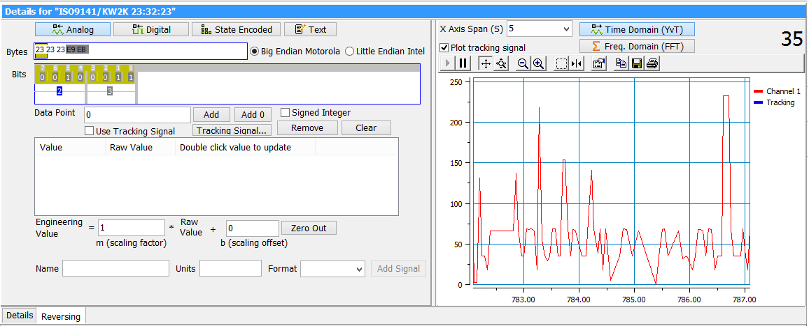
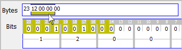
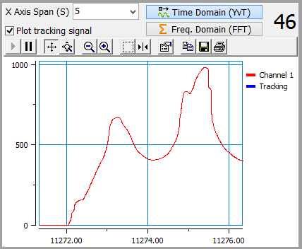
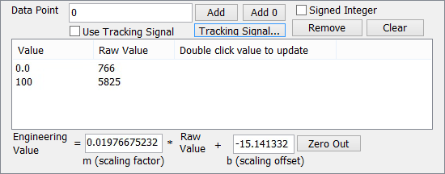

# Message Details Pane

### Overview

Without any databases, trying to investigate and decode unknown signals within a message may not seem possible. Vehicle Spy has many [Reverse Engineering](reverse-engineering.md) features to help. In addition to those features, the Details pane is another tool that can help with that challenging task. The Details pane is opened with the **Details** button on the [Messages view](../) [top toolbar](./).

The Details pane operates on a single message line in the Messages view. It facilitates quick decoding of signals by displaying the individual bytes and bits of the message using the Vehicle Spy [activity highlighting](../messages-view-buffer-display/) feature. A click and drag interface then lets you select different parts of the message as the location of the proposed signal. A signal plot gives instant feedback about how the signal is being decoded.

### Summary of Steps 

Here are steps to help decode an unknown signal with the Message Details pane:

1. Take Vehicle Spy online to collect messages.
2. Click on the message to decode so it's highlighted green in the [Messages view](../messages-view-buffer-display/).
3. Open the Details pane by clicking the **Details** button.\
   \--------
4. Select what signal type it might be. (analog, digital, etc...see examples [here](../../message-editor/message-signals/message-signal-type.md))
5. Click-and-drag to highlight which bytes and bits the signal is in.
6. Watch the plot to see if the current decoding seems ok.
7. If signal is analog, determine its scaling factor and offset.
8. Repeat steps 4 to 7 until you narrow down what looks correct.\
   \--------
9. At the bottom of the Details pane, enter the signal Name, Units, and Format.
10. Click **Add Signal** to add it to the [Messages Editor](../../message-editor/messages-editor-overview.md) Receive table.

The trickier steps (5 to 7) are described in more detail below.

### Step 5 - Highlight the Signal Location (Figure 2)

In the Bytes row along the top, a range of bytes are selected using click and drag to highlight them in yellow. The individual bit and nibble (4-bit) values are then shown in the Bits row below it. From here, a proposed signal is created by clicking and dragging over the desired bits to highlight them in yellow as well. As you change the definition of the signal, the current decoded value is plotted next to the byte/bit selection.

### Step 6 - Watch Feedback from the Plot (Figure 3)

As you change the signal location, the plot next to it shows the signal decoding with a time domain plot that has [Signal Plot](../../../main-menu-measurement/signal-views/signal-plot.md) features. When decoding an analog signal, the goal is to adjust its byte/bit location until its overall shape on the plot seems correct. Line slope and min/max values of the signal can be adjusted in the next step with scaling factors.

There is also an interesting frequency domain plot available that uses an FFT based on frequency of change per second that can eliminate unrealistic signal ranges since most signals that are functions of physical inputs will only change at a certain rate.

### Step 7 - Determine Scaling Factor and Offset for Analog Signals (Figure 4)

Once an acceptable location of an analog signal has been selected, the Details pane offers help for determining the signal scaling and offset. The **scaling factor** **m** affects the slope or rate of change of the signal. The **scaling offset b** affects the min/max values of the signal.

The scaling values can be entered manually as fractions or as their decimal equivalents. For example, a common scaling factor to show 100% with an 8 bit signal can be entered for m as 100/255 or as 0.392157.

### Using Data Points (still using Figure 4)

The scaling values can also be generated by Vehicle Spy using data points. Simulate an engineering value by entering it in the **Data Point** field. After clicking the **Add** button, the raw value of the signal is sampled and then associated with that Data Point. Once two or more Data Points are added, Vehicle Spy will automatically determine the best fit scaling values.

To update the Raw Value for a data point just double click its Value. To remove one data point, click its Value then click the **Remove** button. To clear ALL data points from the list, click the **Clear** button. The **Zero Out** button resets the scaling factor to 1 and offset to 0, but leaves the data points untouched.

### Using a Tracking Signal (still using Figure 4)

An unknown signal can be decoded with help from a Tracking Signal as a reference. This would typically be used to decode an unknown signal in a normal mode message by using a known signal from a diagnostic message. Working with signals in normal mode messages is usually preferred because it can be done passively without spamming a network with diagnostic messages.

To set up a Tracking Signal click the **Tracking Signal** button. Use the [Expression Builder](../../../../shared-features-in-vehicle-spy/shared-features-expression-builder.md) to select a known signal. For example, this might be a signal value from a diagnostic job. Click **Ok** to close the Expression Builder then enable the Tracking Signal checkbox. The Tracking Signal will now be shown on the plot as a useful visual reference to adjust your unknown signal towards.

