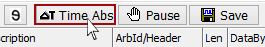

# Messages View Timestamping

[Messages view](../) is capable of displaying two different timestamp types.

The first type is **relative time stamping**. This is the time between this message and the previous one.

For example, if a message had a relative timestamp of 0.250 sec, then the previous message arrived 250 ms earlier.

The second type is **absolute time stamping**. This is the time from the Vehicle Spy start time until that message was received.

Relative time stamping is the default in Vehicle Spy. To switch to absolute time stamping, click the **Time Abs** button (Figure 1) in the Messages view [top toolbar](./). When the button is depressed, absolute time stamping is displayed. To switch back to relative time stamping, simply press the button again. Tapping [predefined function key](../../../../shared-features-in-vehicle-spy/shared-features-predefined-function-keys.md) **F3 then A** will also switch timestamp modes.

The Time Abs button does NOT affect the contents of saved buffers. Saved buffers always have both absolute and relative timestamps.

