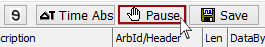
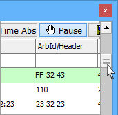

# Pause Messages View

View messages that have already passed by in Messages view scrolling mode by pressing the **Pause** button on the Messages view top toolbar (Figure 1). Tapping predefined function key **F3 then spacebar** will also pause and un-pause the view.

A scroll bar is to the right of the message list (Figure 2). Move through the messages by dragging the scroll bar up and down with your mouse.

**\*Note:** Vehicle Spy will still collect data if it is online while Messages view is paused. Vehicle Spy will overwrite the oldest messages to make way for new messages, assuming that the defined buffer is full. This is the default behavior of Vehicle Spy.

