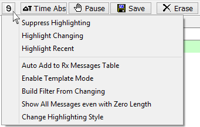

# Reverse Engineering

In addition to the [Message Details Pane](message-details-pane.md), there are Reverse Engineering functions designed to help discover meanings of unknown messages. The Reverse Engineering function set alters the way the [Messages view](../) highlights and colors messages to create a better distinction between signals encoded on the bus with the function actuated.

**Table 1: Reverse Engineering tools.**

| Reverse Engineering Feature             | Description                                                                                                                                                                                                                                                                                                                                                                                                                                                                                                                                                                                                                                                                                     |
| --------------------------------------- | ----------------------------------------------------------------------------------------------------------------------------------------------------------------------------------------------------------------------------------------------------------------------------------------------------------------------------------------------------------------------------------------------------------------------------------------------------------------------------------------------------------------------------------------------------------------------------------------------------------------------------------------------------------------------------------------------- |
| Suppress Highlighting                   | 
Reduces data byte <a href="../messages-view-buffer-display/displaying-signals-in-messages-view.md">activity highlighting</a> until it only shows changes that the user cares about. If data is highlighted that the user does NOT care about, click the <strong>Reverse Engineering</strong> button and select <strong>Suppress Highlighting.</strong> More suppression is added each time this feature is used.  All suppression is cleared (full highlighting returns) after going offline or clicking the <strong>Erase</strong> button.  This feature can help reverse engineer unknown messages and signals by highlighting specific data changes after triggers occur.
 |
| Auto Add to Messages table              | Creates message definitions in the Messages Editor [Receive table](../../message-editor/messages-editor-receive-transmit-and-database-tables.md) for all of the messages as they appear on the bus. This feature helps by giving a starting point for filtering and defining signals.                                                                                                                                                                                                                                                                                                                                                                                                           |
| Highlight Changing                      | Grays out messages that do not have changing data. When message data starts changing, the message switches to its normal color. The purpose of this feature is to help make messages that are changing stand out from the others.                                                                                                                                                                                                                                                                                                                                                                                                                                                               |
| Highlight Recent                        | 
Shows recent messages more clearly. Works only in static display mode.  ON - recent messages are full color and messages older than the specified <a href="../messages-view-bottom-toolbar/messages-view-setup.md">Recent Time</a> are faded.  OFF - all messages are in full color.
                                                                                                                                                                                                                                                                                                                                                                                         |
| Enable Template Mode                    | Template mode gives the option of quickly changing a message from one ID to another. When this feature is enabled and a message is added to the Receive table by right clicking on it, a dialog appears to add that ID over another message. This is very helpful when the message decoding is known, but its ID is not.                                                                                                                                                                                                                                                                                                                                                                        |
| Build Filter from Changing              | Creates Receive messages and Filter for changing frames. This works like **Auto Add to Messages Table** but only targets changing frames and creates a [custom filter](../messages-view-filter-bar/messages-view-custom-filters.md) for those frames.                                                                                                                                                                                                                                                                                                                                                                                                                                           |
| Show All Messages even with Zero Length | This feature shows all messages from the Receive table in the messages view. If a message has not been received yet, the message's count will remain at 0 until it is received.                                                                                                                                                                                                                                                                                                                                                                                                                                                                                                                 |
| Change Highlighting Style               | 
This option allows changing the default highlighting. The 3 options are:
<ul><li>Any Change</li><li>Change Magnitude</li><li>Gradient Change</li></ul>
Change Magnitude and Gradient Change have options for how much of a change is needed before highlighting is enabled. This option helps give a feel of how fast the data is changing which can help determine what a message is.
                                                                                                                                                                                                                                                                                              |
